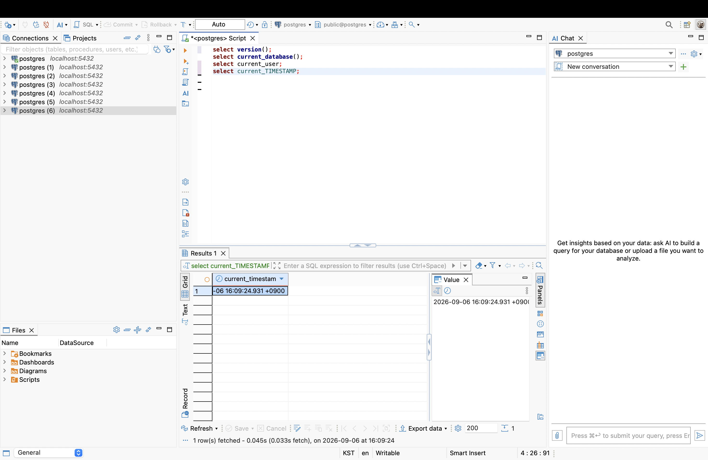
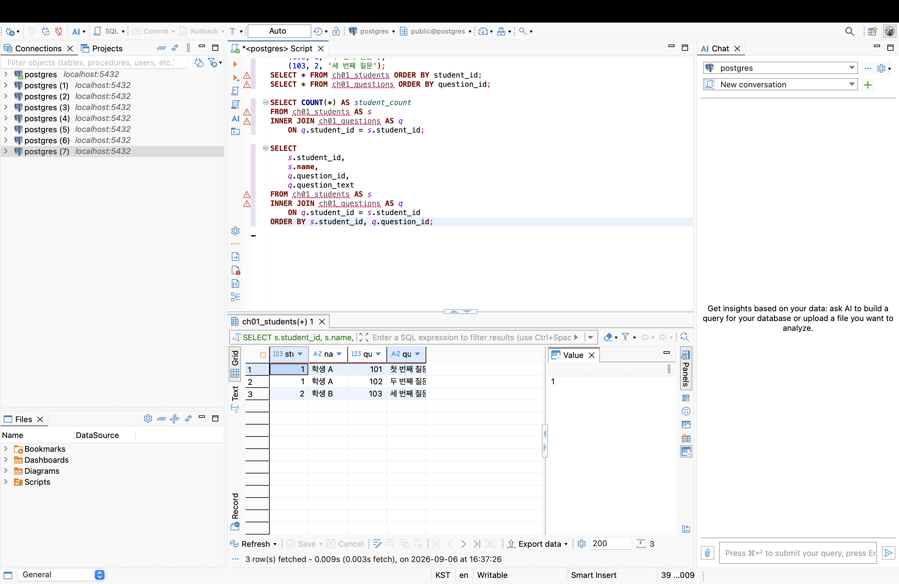
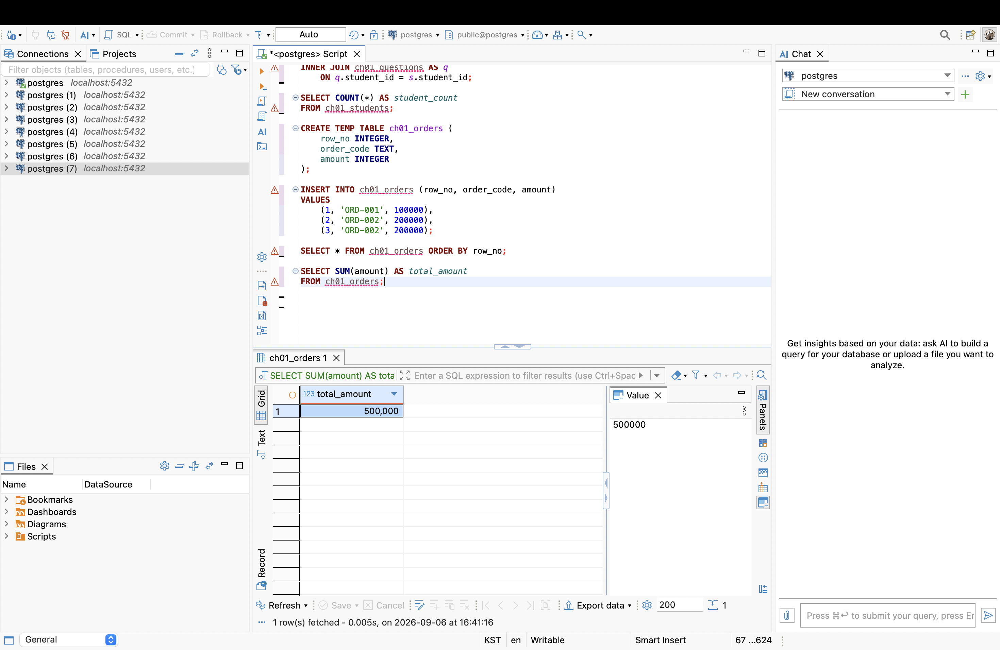
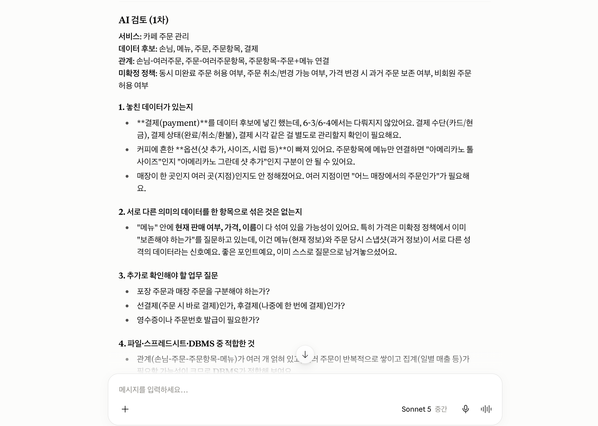

# Chapter 01 확장 실습 답안 템플릿

> **과제:** AI 시대에 데이터베이스를 왜 배워야 하는가  
> **사용 방법:** 이 파일을 내려받아 **본인의 GitHub 저장소**에 `chapter01_answer.md`라는 이름으로 저장한 뒤 답안을 작성합니다.  
> **제출 방법:** LMS에는 파일을 업로드하지 않고, **본인 GitHub 저장소의 `chapter01_answer.md` 파일 URL**을 제출합니다.

---

## 0. 학생 정보

| 항목 | 작성 내용 |
| --- | --- |
| 학번 | 2024-14911 |
| 이름 | 이연주 |
| GitHub 계정 | dusen120-ai |
| 과제 작성일 | 2026-09-06 |
| 사용한 AI 도구 | Claude |

> 실제 비밀번호, API Key, 전체 DB 접속 URL, 개인정보는 이 파일이나 캡처 화면에 기록하지 않습니다.

---

# 1. PostgreSQL 실행 환경 확인

## 1-1. 실행한 SQL

```sql
SELECT version();
SELECT current_database();
SELECT current_user;
SELECT CURRENT_TIMESTAMP;
```

## 1-2. 실행 결과 기록

```text
PostgreSQL 버전: PostgreSQL 16.15 (Homebrew) on aarch64-apple-darwin24.6.0, compiled by Apple clang version 17.0.0 (clang-1700.6.4.2), 64-bit
현재 데이터베이스: postgres
현재 사용자: a82103
현재 시각: 2026-09-06 17:00:38.670873+09
```

## 1-3. 내가 확인한 내용

1. SQL을 작성하는 프로그램과 PostgreSQL은 같은 프로그램인가요?

```text
나의 답: 아니다. PostgreSQL은 데이터를 실제로 저장하고 SQL을 해석·실행해서 결과를 돌려주는 서버(DBMS) 자체이고,
psql이나 DBeaver 같은 도구는 그 서버에 접속해서 SQL을 입력하고 결과를 보여주는 클라이언트일 뿐이다.
```

2. `current_database()` 결과는 무엇을 의미하나요?

```text
나의 답: 지금 내가 어떤 데이터베이스에 접속해 있는지를 알려준다. 하나의 PostgreSQL 서버 안에는 여러 개의
데이터베이스가 존재할 수 있어서, 어떤 DB에 연결했는지에 따라 보이는 테이블과 데이터가 완전히 달라진다.
```

3. SQL이 실행되었다는 사실만으로 데이터 내용도 올바르다고 할 수 있나요?

```text
나의 답: 아니다. 3번 실습에서 INNER JOIN SQL은 에러 없이 실행되어 student_count = 3이 나왔지만, 이 값은
실제로는 "학생 수"가 아니라 "학생-질문이 매칭된 행 수"였고 우연히 실제 학생 수와 같았을 뿐이다.
실행 성공과 결과의 의미가 정확한지는 별개의 문제다.
```

## 1-4. 증거 화면

아래 경로에 캡처 이미지를 저장하는 것을 권장합니다.

```text
assignments/chapter01/images/step01_environment.png
```

이미지를 저장했다면 아래 링크의 파일명을 실제 파일명에 맞게 수정합니다.

```markdown

```

**이미지 삽입 위치:**


---

# 2. Chapter 01 핵심 내용 복습

교재 문장을 그대로 복사하지 말고 자신의 말로 작성합니다.

| 본문의 핵심 | 나의 설명 |
| --- | --- |
| AI가 SQL을 만들어도 DB를 배워야 한다 | AI는 SQL 문법은 완벽하게 짤 수 있지만, 그 결과가 내 데이터 구조와 업무 맥락에서 실제로 맞는지는 판단하지 못한다. 결과를 검증하려면 사람이 DB 구조를 알아야 한다. |
| 데이터 구조가 중요하다 | 학생-질문이 1:N 관계라는 걸 몰랐다면 JOIN하면 학생이 질문 개수만큼 중복돼서 나온다는 걸 예상하지 못했을 것이다. |
| SQL 결과를 검증해야 한다 | 실행이 성공했다는 것과 결과가 정확하다는 것은 다르다. 질문을 하나 추가했을 때 JOIN 결과(4)와 실제 학생 수(3)가 어긋난 게 직접적인 증거다. |
| 데이터 품질이 AI 답변 품질에 영향을 준다 | ORD-002가 중복 입력된 상태로 AI에게 물어보면, AI는 그 중복이 실수인지 실제 2건인지 알 수 없어서 합계를 그대로 계산해버린다. |
| 저장 방식은 데이터 양만 보고 선택하지 않는다 | 데이터가 적어도 동시 수정, 관계, 정확성 요구가 있으면 DBMS가 필요하고, 데이터가 많아도 혼자 쓰고 관계가 단순하면 파일로 충분할 수 있다. |

## 가장 중요하다고 생각한 한 문장

```text
문법이 맞아서 SQL이 에러 없이 실행됐다는 것과, 그 결과가 실제로 내가 원하는 의미를 정확히 담고 있다는 것은
전혀 다른 문제라는 점이 가장 중요하다고 느꼈다.
```

---

# 3. 실행 성공과 결과 정확성의 차이

## 3-1. SQL 실행 전 예상

학생 A는 질문 2개, 학생 B는 질문 1개, 학생 C는 질문이 없습니다.

```text
전체 학생 수: 3 명
전체 질문 수: 3 개
질문이 있는 학생 수: 2 명
질문이 없는 학생 수: 1 명
```

## 3-2. 임시 테이블 생성 및 데이터 입력 완료 확인

- [x] `ch01_students` 생성
- [x] `ch01_questions` 생성
- [x] 학생 3명 입력
- [x] 질문 3건 입력
- [x] 두 테이블의 데이터를 직접 조회

## 3-3. 잘못된 학생 수 SQL 실행 결과

실행한 SQL:

```sql
SELECT COUNT(*) AS student_count
FROM ch01_students AS s
INNER JOIN ch01_questions AS q
    ON q.student_id = s.student_id;
```

실행 결과:

```text
student_count = 3
```

## 3-4. JOIN 상세 결과 관찰

```text
학생 A가 나타난 행 수: 2
학생 B가 나타난 행 수: 1
학생 C가 나타난 행 수: 0
```

다음 질문에 답합니다.

### Q1. 학생 C가 왜 결과에서 사라졌나요?

```text
INNER JOIN은 양쪽 테이블에 모두 매칭되는 행만 결과에 포함시킨다. 학생 C는 ch01_questions 테이블에
student_id = 3인 행이 하나도 없기 때문에 ON 조건을 만족하는 짝이 없어서 결과에서 완전히 빠졌다.
```

### Q2. 학생 A가 왜 여러 행으로 나타났나요?

```text
JOIN은 한쪽 행을 기준으로 매칭되는 다른 쪽 행의 개수만큼 결과 행을 복제한다. 학생 A는 질문이 2개(추가 후 3개)라서
학생 A 행이 그 질문 개수만큼 중복되어 나타났다.
```

### Q3. 위 `COUNT(*)`가 실제로 세고 있었던 것은 무엇인가요?

```text
학생 수가 아니라 학생-질문이 매칭된 행(row)의 개수, 즉 질문이 있는 학생들의 질문 총 개수를 세고 있었다.
```

### Q4. 결과 숫자가 우연히 실제 학생 수와 같아도 바로 믿으면 안 되는 이유는 무엇인가요?

```text
처음엔 JOIN 결과(3)와 실제 학생 수(3)가 우연히 일치했지만, 이는 논리적으로 같다는 보장이 전혀 없었다.
실제로 질문을 하나 추가하자 JOIN 결과는 4로 바뀌었지만 실제 학생 수는 그대로 3이었다. 숫자가 같다는 건
데이터가 우연히 그런 상태였을 뿐이라, 쿼리 로직 자체가 학생 수를 정확히 센다는 걸 보장하지 않는다.
```

## 3-5. 질문 한 건을 추가한 뒤 다시 실행

추가한 데이터:

```text
question_id=4, student_id=1 (학생 A), question_text='학생 A의 질문 3'
```

다시 실행한 결과:

```text
AI SQL 결과: 4
실제 학생 수: 3
```

### 결과 해석

```text
데이터가 바뀐 뒤 무엇이 달라졌는지: 질문을 1건 추가하자 INNER JOIN COUNT 결과가 3에서 4로 바뀌었다.

실제 학생 수는 왜 그대로인지: ch01_students 테이블에는 아무 변화가 없었고, 질문만 추가되었기 때문이다.

이 실험을 통해 알게 된 점: JOIN 결과의 COUNT는 학생 수가 아니라 질문(매칭된 행) 개수를 세고 있었다는 것을
데이터 변화로 직접 확인할 수 있었다.
```

## 3-6. 학생 테이블을 직접 센 결과

```sql
SELECT COUNT(*) AS student_count
FROM ch01_students;
```

결과:

```text
student_count = 3
```

### 두 SQL의 차이를 내 말로 설명

```text
첫 번째 SQL은 학생-질문이 매칭된 행(=질문이 있는 학생들의 질문 총 개수)을 세고 있었다.

두 번째 SQL은 JOIN 없이 ch01_students 테이블 자체의 실제 행 수(=진짜 학생 수)를 세고 있었다.

따라서 SQL을 검토할 때는 문법보다 먼저
이 COUNT가 어떤 테이블을 기준으로, 어떤 관계(JOIN)를 거쳐서 세고 있는 것인지를 확인해야 한다.
```

## 3-7. 증거 화면

권장 경로:

```text
assignments/chapter01/images/step03_join_result.png
```



---

# 4. 잘못된 데이터가 결과를 바꾸는 과정

## 4-1. 주문 데이터 확인

다음 데이터를 입력한 뒤 실제 결과를 확인합니다.

```text
ORD-001, 100000
ORD-002, 200000
ORD-002, 200000
```

## 4-2. 실행 전 예상

업무적으로 주문이 `ORD-001`, `ORD-002` 두 건이고 `order_code`가 주문을 고유하게 구분한다고 **가정할 경우** 예상 합계:

```text
300,000 원
```

> 위 가정 자체가 실제 업무 규칙인지 확인해야 한다는 점도 기억합니다.

## 4-3. SQL 합계

```sql
SELECT SUM(amount) AS total_amount
FROM ch01_orders;
```

실제 결과:

```text
500,000 원
```

## 4-4. 결과 해석

### `SUM` 문법 자체가 잘못된 것인가요?

```text
아니다. SELECT SUM(amount) ... 문법은 전혀 잘못되지 않았고, 테이블에 들어있는 amount 값을 정확하게 다 더했다.
```

### 결과 차이의 원인은 무엇인가요?

```text
ORD-002가 테이블에 똑같은 내용으로 두 번 입력되어 있었기 때문이다. 주문이 2건이라고 가정해서 300,000원을
예상했지만, 실제 테이블에는 행이 3개(ORD-001 1개, ORD-002 2개) 들어 있어서 SUM이 3개 행을 모두 더해
500,000원이 나왔다.
```

### SQL이 정확하게 실행되어도 업무 숫자가 잘못될 수 있는 이유를 설명하세요.

```text
SQL은 테이블에 실제로 들어있는 행을 있는 그대로 계산할 뿐, 그 행이 업무적으로 정상적인 한 건의 주문인지
실수로 중복 입력된 것인지는 판단하지 못한다. 결과 숫자가 이상할 때는 SQL 문법이 아니라 원본 데이터의
정확성(중복, 누락, 오입력 여부)을 먼저 의심해야 한다.
```

## 4-5. AI에게 같은 데이터를 분석시킨 결과

AI가 계산한 합계:

```text
500,000원 (ORD-001: 100,000원 + ORD-002: 200,000원 + ORD-002: 200,000원)
```

AI가 중복 가능성을 언급했나요?

```text
네. AI에게 데이터를 그대로 주자 계산은 500,000원으로 해주면서도, "ORD-002가 두 번 나타나는데 이게 서로 다른
두 건의 주문인지 아니면 같은 주문이 중복 입력된 것인지 확인이 필요하다"는 식으로 중복 가능성을 함께 언급했다.
```

AI가 `ORD-002` 두 행이 실제 두 주문인지 중복 입력인지 스스로 확정할 수 있나요? 이유도 적으세요.

```text
아니다. AI는 주어진 텍스트(order_code, amount)만 보고 있을 뿐, order_code가 우리 업무 시스템에서 주문을
유일하게 식별하는 값인지, 한 주문이 여러 줄로 나뉠 수 있는 구조인지에 대한 업무 규칙 정보가 전혀 없어서
데이터만 보고는 정상인지 오류인지 판단할 근거가 부족하다.
```

추가로 확인해야 할 업무 규칙:

```text
1. order_code가 주문 1건을 유일하게 식별하는 값인가, 아니면 중복될 수 있는가?
2. 한 주문이 여러 줄(라인 아이템)로 나뉘어 기록되는 구조인가?
3. 데이터를 입력한 시스템/사람이 이중 입력 방지 로직을 가지고 있는가?
```

내가 최종적으로 내린 판단:

```text
현재 정보만으로는 500,000원을 실제 매출로 확정할 수 없다. order_code의 유일성 규칙을 담당자에게 확인하기
전까지는 300,000원(2건)일 가능성도 열어두고, 원본 데이터의 중복 여부부터 검증해야 한다.
```

## 4-6. 증거 화면

권장 경로:

```text
assignments/chapter01/images/step04_duplicate_result.png
```



---

# 5. 파일·스프레드시트·DBMS 선택 연습

각 사례에 대해 **AI에게 묻기 전에 먼저 본인의 판단을 작성**합니다.

## 사례 A. 개인 독서 기록

```text
나의 선택: 파일 (예: 텍스트 파일, 마크다운 메모)
선택 이유: 사용자가 나 혼자뿐이고, 동시에 여러 명이 수정할 일이 없으며, 데이터 간 복잡한 관계도 필요 없다.
검색이나 집계도 거의 안 하고 기록·회고 목적이라 가장 가볍고 관리 부담이 적은 파일로 충분하다.
어떤 조건이 추가되면 다른 방식으로 바꿀 것인지: 친구들과 독서 기록을 공유하거나 책 제목/평점으로
정렬·검색·통계를 자주 내고 싶어진다면 스프레드시트로 옮길 것이다.
```

## 사례 B. 동아리 행사 신청 명단

```text
나의 선택: 스프레드시트 (예: Google Sheets)
선택 이유: 신청자 명단은 표 형태로 관리하기 편하고, 여러 운영진이 동시에 열어서 확인·수정해야 하는 경우가 많다.
실시간 공동 편집과 간단한 필터·정렬 기능이면 이 정도 규모(한 학기 행사 몇 개)에는 적합하다.
어떤 조건이 추가되면 다른 방식으로 바꿀 것인지: 신청 인원이 수백~수천 명 단위로 늘어나거나, 여러 행사·여러 학기
데이터를 서로 연결해서 통계를 내야 하거나, 권한을 세밀하게 나눠야 한다면 DBMS로 옮길 것이다.
```

## 사례 C. 온라인 강의 서비스

```text
나의 선택: DBMS (예: PostgreSQL, MySQL)
선택 이유: 사용자(수강생), 강의, 결제, 수강 이력 등 여러 데이터가 서로 관계를 맺고 있고, 동시에 아주 많은 사용자가
접속해서 읽기/쓰기를 한다. 결제·수강 여부 같은 데이터는 정확성과 일관성이 중요하고, 서비스가 계속 실행되며
데이터가 지속적으로 누적되기 때문에 파일이나 스프레드시트로는 감당이 안 된다.
어떤 조건이 추가되면 다른 방식으로 바꿀 것인지: 실제 서비스가 아니라 강의안을 혼자 정리하는 개인 프로젝트
수준이라면 굳이 DBMS까지는 필요 없고 스프레드시트로도 충분할 것이다.
```

## 판단 기준 체크

- [ ] 데이터 증가
- [x] 여러 사용자의 동시 수정
- [x] 데이터 사이의 관계
- [ ] 반복 조회와 집계
- [x] 정확성·일관성
- [ ] 변경 이력
- [x] 권한 구분
- [ ] 백업·복구
- [x] 웹·앱에서 지속 사용

### 데이터가 적으면 무조건 스프레드시트를 사용해야 하나요?

```text
나의 답: 아니다. 데이터 양은 판단 기준 중 하나일 뿐이다. 사례 C처럼 데이터 양이 적더라도 여러 사용자의 동시 접근,
데이터 간 관계, 정확성·일관성 요구, 권한 구분이 필요하다면 DBMS를 써야 한다. 반대로 사례 A처럼 데이터가 계속
쌓여도 혼자만 쓰고 관계가 단순하면 파일로 충분할 수 있다. 즉 선택 기준은 데이터 양이 아니라 동시 사용자 수,
데이터 간 관계, 정확성 요구, 변경 이력·권한 관리 필요성 등을 종합적으로 봐야 한다.
```

---

# 6. 나만의 서비스 데이터 구조 초안

> 이 내용은 이후 Chapter에서 계속 확장할 수 있으므로 신중하게 작성합니다.

## 6-1. 서비스 정의

```text
서비스 이름: 카페 주문 관리

이 서비스는
카페가 주문 내역과 결제를 관리
하기 위한 서비스이다.
```

## 6-2. 관리할 데이터 후보

```text
1. 주문
2. 메뉴
3. 수량
4. 취식 방식
5. 결제
```

## 6-3. 한 행의 의미

| 데이터 후보 | 한 행의 의미 |
| --- | --- |
| 주문 | 몇 번째로 들어온 주문인지 |
| 메뉴 | 주문한 메뉴 |
| 수량 | 메뉴 수량 |
| 취식 방식 | 매장 안에서 먹는지, 테이크아웃인지 |
| 결제 | 결제 방식 |

## 6-4. 관계를 자연어로 설명

```text
1. 한 주문은 순번으로 구분되며, 하나 이상의 메뉴와 수량을 담을 수 있다.
2. 한 주문은 매장 또는 테이크아웃 중 하나의 취식 방식을 가진다.
3. 한 주문은 하나의 결제와 연결된다.
```

## 6-5. 아직 결정하지 않은 정책

```text
Q1. 한 손님이 이미 진행 중인 주문이 있는 상태에서 또 주문할 수 있는가?
Q2. 주문 후 메뉴를 취소하거나 수량을 변경할 수 있는가?
Q3. 메뉴 가격이 나중에 바뀌면 어떻게 해야하는가?
```

> 확정되지 않은 정책을 AI가 임의로 결정한 경우 그대로 받아들이지 않습니다.

---

# 7. AI를 검토자로 활용하기

## 7-1. 내가 AI에게 전달한 핵심 프롬프트

개인정보나 비밀번호 등 민감한 내용은 제거한 뒤 기록합니다.

```text
나는 데이터베이스를 처음 배우는 학생입니다.
아직 ERD나 정규화를 배우기 전입니다.
내가 생각한 서비스는 다음과 같습니다.

서비스: 카페 주문 관리
목적: 손님이 카페에서 메뉴를 주문하고, 카페는 주문 내역과 결제를 관리한다.

관리할 데이터 후보:
- 주문 순번 (몇 번째 손님/주문인지)
- 메뉴
- 수량
- 취식 방식 (매장 / 테이크아웃)
- 결제
내가 생각한 관계:
- 한 주문은 순번으로 구분되며, 하나 이상의 메뉴와 수량을 담을 수 있다.
- 한 주문은 매장 또는 테이크아웃 중 하나의 취식 방식을 가진다.
- 한 주문은 하나의 결제와 연결된다.

아직 결정하지 못한 정책:
- 주문 후 메뉴를 취소하거나 수량을 변경할 수 있는가? 있다면 언제까지 가능한가?
- 메뉴 가격이 나중에 바뀌면, 이미 지나간 주문의 금액도 새 가격으로 다시 계산해야 하는가, 아니면 주문 당시 가격을 그대로 보존해야 하는가?

지금 단계에서는 완성된 SQL을 만들지 말고,
1. 내가 놓친 데이터가 있는지,
2. 서로 다른 의미의 데이터를 한 항목으로 섞은 것은 없는지,
3. 추가로 확인해야 할 업무 질문은 무엇인지,
4. 파일·스프레드시트·관계형 DBMS 중 무엇이 적합해 보이는지
초보자가 이해할 수 있게 검토해 주세요.
확정되지 않은 정책은 임의로 정답처럼 결정하지 마세요.
```

## 7-2. AI의 주요 제안과 나의 판단

최소 5개를 작성합니다.

| AI의 제안 | 수용 / 수정 / 거절 | 나의 판단 근거 |
| --- | --- | --- |
| 결제 데이터 구체화 (수단·상태·시각) | 수용 | 실제 운영에 필요한 정보인데 빠져 있었음 |
| 커피 옵션(샷, 사이즈 등) 추가 | 수용 | 옵션 없이는 주문 내용이 불완전함 |
| 여러 지점 관리 | 거절 | 카페 한 곳만 가정하는 게 지금 목적에 맞고, 지점 확장은 나중 문제 |
| 메뉴 가격 스냅샷 분리 (주문 당시 가격 보존) | 수용 | 메뉴 가격이 바뀌어도 과거 주문 금액은 그대로 유지돼야 함 |
| 선결제/후결제 구분 | 거절 | 카페 주문은 보통 선결제가 기본이라 별도 정책으로 다루지 않아도 된다고 판단 |

## 7-3. AI에게 자기 답변을 다시 비판하도록 요청한 결과

첫 번째 답변과 달라진 점:

```text
1차는 "무엇을 추가하면 좋을지"에 집중했다면, 2차는 1차 답변에서 근거 없이 단정한 부분(스냅샷 구현 방식을 확정한 것,
선결제를 당연하다고 가정한 것)을 다시 짚어내고, 지금 단계에서 확정할 수 없는 부분과 추가로 확인이 필요한 부분을
구분해서 알려주었다.
```

AI가 처음에 임의로 가정했던 내용:

```text
"메뉴 가격 스냅샷 분리"를 마치 반드시 별도 테이블로 나눠야 하는 것처럼 얘기했는데, 지금 단계에서는 확정할 수 없다.
```

추가로 업무 담당자에게 확인해야 한다고 판단한 내용:

```text
선결제를 당연하다고 가정했는데, 실제로는 카페 운영 방식(테이블 오더 등)에 따라 다를 수 있어 확인이 필요할 수 있다.
```

## 7-4. AI 활용에 대한 나의 평가

```text
가장 유용했던 부분: 커피 옵션에 대한 부분을 제시해준 것

수정하거나 거절한 부분: 여러 지점 관리, 선결제/후결제 구분

그렇게 판단한 근거: 여러 지점 관리에 대한 필요성은 없다고 판단했고, 카페 주문은 보통 선결제이므로
선결제/후결제를 굳이 구분할 필요성도 없다고 판단했다.

AI가 없었다면 놓쳤을 가능성이 있는 질문: 메뉴 가격 스냅샷 분리, 결제 데이터 구체화
```

## 7-5. AI 활용 증거 화면

권장 경로:

```text
assignments/chapter01/images/step07_ai_review.png
```

AI 대화 전체를 캡처할 필요는 없습니다. 핵심 요청과 검토 과정이 보이는 화면 1장 정도면 충분합니다.



---

# 8. 기준 데이터·파생 데이터·AI 생성 결과 구분

내 서비스에 맞게 작성합니다.

| 구분 | 내 서비스의 예 | 판단 이유 |
| --- | --- | --- |
| 기준 데이터 | 주문 메뉴, 수량, 취식 방식, 결제 수단, 주문 시각 | 손님이 실제로 선택하고 직원이 입력한 원본 사실이라 모든 계산의 출발점이 됨 |
| 파생 데이터 | 일별/월별 매출 합계, 메뉴별 판매 순위, 평균 객단가 | 기준 데이터(주문)를 집계·가공해서 계산해 낸 값이라 원본이 바뀌면 다시 계산해야 함 |
| AI 생성 결과 | AI가 판매 데이터를 보고 제안한 "다음 주 예상 매출", "추천 메뉴 구성" | 사람이 직접 확인한 사실이 아니라 AI의 추론이라, 원본 데이터로 검증하기 전까지 그대로 믿으면 안 됨 |

### 기준 데이터가 변경되면 파생 데이터는 어떻게 해야 하나요?

```text
기준 데이터(예: 주문 취소, 금액 정정)가 바뀌면 그것을 근거로 계산된 파생 데이터(일별 매출 합계, 판매 순위 등)도
반드시 다시 계산해야 한다. 그렇지 않으면 기준 데이터와 파생 데이터가 서로 어긋나서, 실제로는 취소된 주문 금액이
매출 통계에 계속 남아있는 것처럼 잘못된 숫자가 유지된다.
```

### AI 결과만 있고 원본 데이터가 없다면 결과를 충분히 검증할 수 있나요?

```text
아니다. AI가 만든 예측이나 추천이 어떤 주문 데이터를 근거로 그런 결론에 도달했는지 확인하려면 원본 기준 데이터가
있어야 한다. 원본 데이터 없이 AI 결과만 있으면 그 결과가 실제 상황을 정확히 반영한 것인지, 어떤 가정 위에서 나온
것인지 되짚어 확인할 방법이 없어서 충분히 검증할 수 없다.
```

---

# 9. 최종 성찰

아래 세 문장은 반드시 **본인의 말**로 작성합니다.

```text
1. SQL이 실행되어도 결과를 바로 믿으면 안 되는 이유는
   문법이 맞아서 에러 없이 실행됐다는 것과, 그 결과가 내가 원하는 의미(예: 실제 학생 수)를 정확히 담고 있다는 것은
   전혀 다른 문제이기 때문 이다.

2. AI를 데이터베이스 학습에 활용할 때 가장 중요한 것은
   AI가 제안한 내용을 그대로 받아들이지 않고, 무엇을 근거 없이 임의로 가정했는지 스스로 따져보고 업무 규칙을
   직접 확인하는 태도 이다.

3. 이번 실습 이후 내가 더 확인하고 싶은 것은
   ERD와 정규화를 배운 뒤, 카페 주문 관리 서비스의 주문-메뉴-결제 관계를 실제 테이블 구조로 어떻게 설계해야
   하는지 이다.
```

## 이번 Chapter에서 새롭게 알게 된 점 3가지

```text
1. INNER JOIN 결과의 COUNT는 "학생 수"가 아니라 "매칭된 행 수"를 센다는 것
2. 문법이 정확한 SQL도 데이터 자체가 중복·오류가 있으면 잘못된 업무 숫자를 낼 수 있다는 것
3. AI 검토 결과에서 AI가 근거 없이 확정해버린 가정과, 실제로 확인이 필요한 질문을 구분해야 한다는 것
```

## 아직 이해가 명확하지 않은 부분

```text
1. 메뉴 가격이 바뀌었을 때 과거 주문 금액을 어떻게 보존해야 하는지(스냅샷 구조)를 실제 테이블로 어떻게 만드는지
2. 한 주문에 여러 메뉴가 담기는 관계를 정규화 없이 설계하면 어떤 문제가 생기는지
```

---

# 10. 제출 전 자기 점검

- [x] PostgreSQL 실행 화면을 확인했다.
- [x] SQL 실행 전에 예상 결과를 먼저 작성했다.
- [x] `INNER JOIN` 예제에서 누락과 반복을 설명할 수 있다.
- [x] 숫자가 우연히 같아도 의미가 다를 수 있음을 설명했다.
- [x] 중복 데이터가 집계 결과에 미치는 영향을 확인했다.
- [x] 저장 방식을 데이터 양만으로 판단하지 않았다.
- [x] 개인 서비스 주제를 하나 정했다.
- [x] 데이터 후보와 한 행의 의미를 작성했다.
- [x] 미확정 정책을 최소 3개 작성했다.
- [x] AI 제안을 수용·수정·거절로 구분했다.
- [x] AI 제안에 대한 판단 근거를 작성했다.
- [x] 기준 데이터·파생 데이터·AI 결과를 구분했다.
- [x] 핵심 증거 이미지가 Markdown에서 정상적으로 보인다.
- [x] 비밀번호·API Key·개인정보가 노출되지 않았다.

---

# 11. LMS 제출 정보

## 내 GitHub 답안 파일 URL

아래에는 **교수자 템플릿 URL이 아니라 본인이 작성한 답안 파일의 GitHub URL**을 기록합니다.

```text
https://github.com/<본인-GitHub-ID>/<본인-저장소>/blob/main/assignments/chapter01/chapter01_answer.md
```

내 실제 제출 URL:

```text
https://github.com/dusen120-ai/database/blob/main/assignments/chapter01/chapter01_answer.md
```

> LMS에는 위 **본인 저장소의 `chapter01_answer.md` 파일 URL 하나**를 제출합니다.

---

## 권장 학생 저장소 구조

```text
<본인-저장소>/
└── assignments/
    └── chapter01/
        ├── chapter01_answer.md
        └── images/
            ├── step01_environment.png
            ├── step03_join_result.png
            ├── step04_duplicate_result.png
            └── step07_ai_review.png
```

이 구조를 사용하면 이후 Chapter 02, Chapter 03도 같은 방식으로 계속 추가할 수 있습니다.
