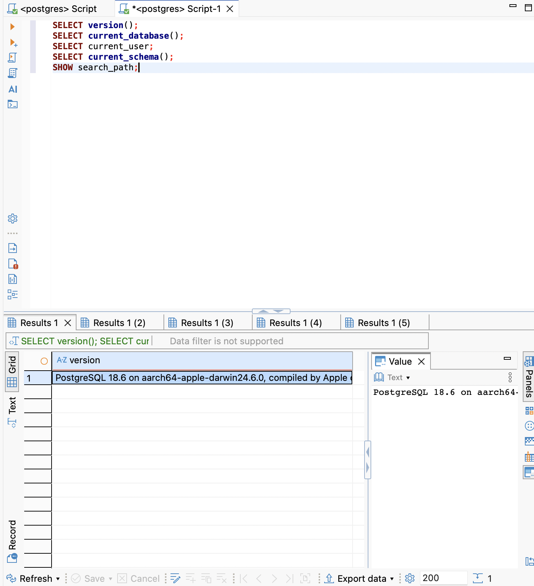
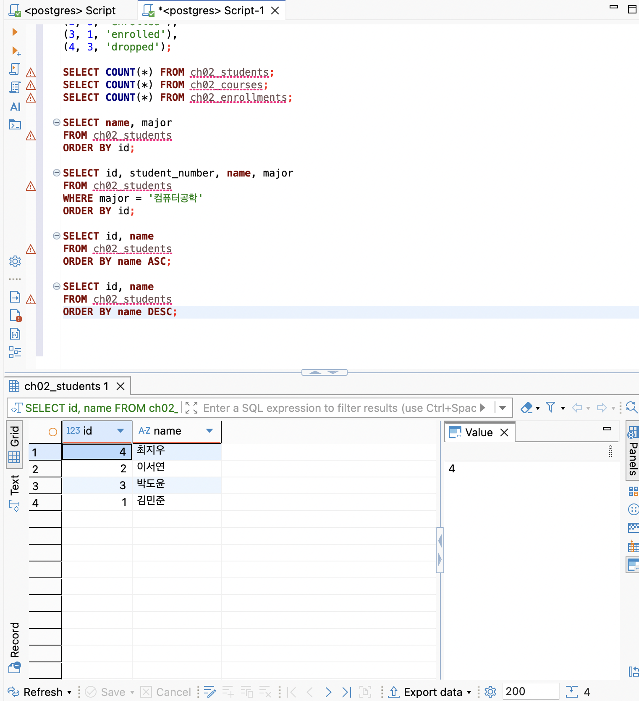
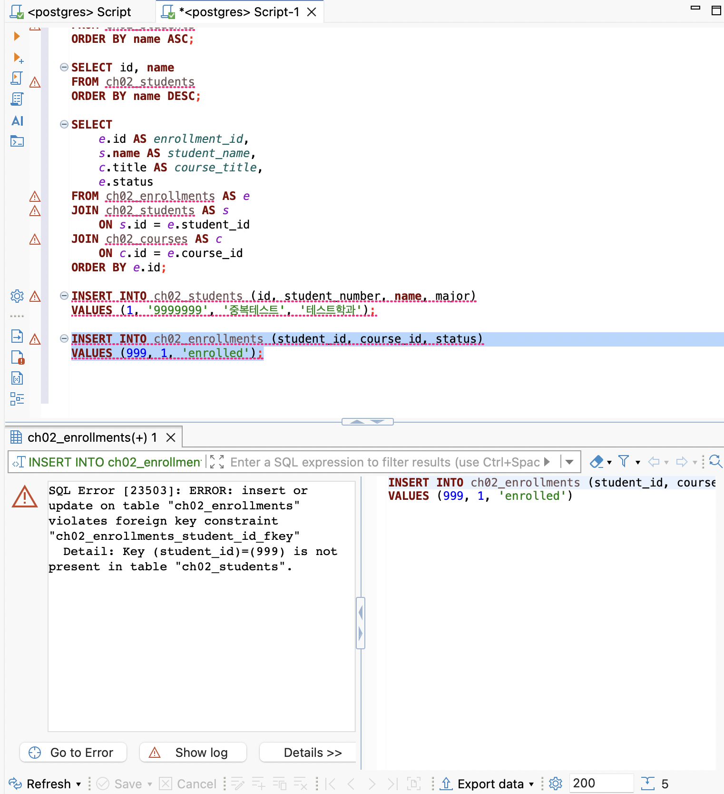
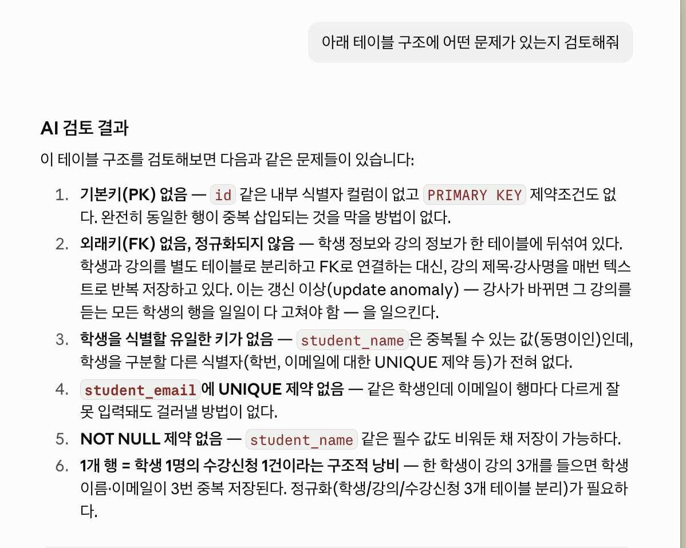

# Chapter 02 확장 실습 답안 템플릿

> **과제:** 데이터와 DBMS의 기본 개념  
> **사용 방법:** 이 파일을 내려받아 본인의 GitHub 저장소에 `chapter02_answer.md`라는 이름으로 저장한 뒤 실습하면서 바로 작성합니다.  
> **제출 방법:** LMS에는 파일을 직접 업로드하지 않고, **본인 GitHub 저장소의 `chapter02_answer.md` 파일 URL**을 제출합니다.

---

## 제출 전 개인정보 주의

LMS에서 제출자를 확인할 수 있으므로 이 공개 Markdown 파일에 학번이나 실명을 반드시 적을 필요는 없습니다.

```text
GitHub 계정 또는 별칭: dusen120-ai
과제 작성일: 2026-09-09
사용한 AI 도구: Claude (Claude Code)
```

> 실제 비밀번호, API Key, 전체 DB 접속 URL, 개인정보가 포함된 화면은 올리지 않습니다.

---

# 1. PostgreSQL에서 현재 위치 확인

## 1-1. 실행한 SQL

```sql
SELECT version();
SELECT current_database();
SELECT current_user;
SELECT current_schema();
SHOW search_path;
```

## 1-2. 실행 결과 기록

```text
PostgreSQL 버전: PostgreSQL 18.6 on aarch64-apple-darwin24.6.0, compiled by Apple clang
현재 데이터베이스: postgres
현재 사용자: postgres
현재 스키마: public
search_path: public, "$user"
```

## 1-3. 구조를 내 말로 설명

```text
PostgreSQL은: 데이터를 저장하고 관리해주는 소프트웨어(DBMS, 데이터베이스 관리 시스템)이다.

현재 접속한 데이터베이스는: postgres — PostgreSQL 서버 안에 있는 여러 데이터베이스 중 하나로, 내가 만든 테이블과 데이터가 실제로 저장되는 논리적 공간이다.

스키마는: 데이터베이스 안에서 테이블/뷰 같은 객체들을 묶어서 정리하는 폴더 같은 단위이다 (기본값은 public).

DBeaver 또는 psql 같은 도구는: PostgreSQL 서버에 직접 접속해서 SQL을 실행하고 결과를 보여주는 클라이언트 프로그램이다. DBMS 자체가 아니라 DBMS에 접속하는 창구이다.
```

## 1-4. 계층 구조 완성

```text
사용자
→ DBeaver / psql (클라이언트 도구)
→ PostgreSQL DBMS
→ postgres (데이터베이스)
→ public (스키마)
→ 테이블 (예: ch02_students)
→ 행 / 열
```

## 1-5. 증거 화면

권장 경로:

```text
assignments/chapter02/images/step01_environment.png
```

```markdown

```


---

# 2. 데이터베이스 안의 스키마와 테이블 관찰

## 2-1. 스키마 조회 결과

실행한 SQL:

```sql
SELECT schema_name
FROM information_schema.schemata
ORDER BY schema_name;
```

관찰한 스키마 이름 중 3개 이내를 적습니다.

```text
1. information_schema
2. practice
3. public
```

### `public`은 무엇인가요?

```text
나의 설명: PostgreSQL이 기본으로 제공하는 스키마로, 스키마를 따로 지정하지 않고 테이블을 만들면 기본적으로 이 public 스키마 안에 생성된다.
```

### 데이터베이스와 스키마는 같은 것인가요?

```text
나의 설명: 아니다. 데이터베이스가 더 큰 단위이고, 스키마는 그 안에서 테이블·뷰 같은 객체들을 그룹으로 나누는 하위 폴더 같은 단위이다. 하나의 데이터베이스 안에 여러 스키마가 존재할 수 있다.
```

## 2-2. 현재 보이는 테이블 조회

```sql
SELECT table_schema, table_name
FROM information_schema.tables
WHERE table_type = 'BASE TABLE'
  AND table_schema NOT IN ('pg_catalog', 'information_schema')
ORDER BY table_schema, table_name;
```

```text
조회된 사용자 테이블 수 또는 눈에 띈 테이블: practice 스키마의 members 테이블 1개. public 스키마에는 아직 테이블이 없음.

아직 테이블이 거의 없어도 괜찮은 이유: 이번 실습(chapter02)에서 아직 새 테이블을 만들지 않았고, 이후 TEMP TABLE(ch02_students 등)을 생성하면서 테이블이 늘어날 것이기 때문이다. 또한 시스템 스키마(pg_catalog, information_schema)는 조회에서 제외했기 때문에 사용자가 만든 테이블만 보인다.
```

## 2-3. 관찰 정리

```text
PostgreSQL 서버 안에는 여러 데이터베이스가 있을 수 있다.
한 데이터베이스 안에는 여러 스키마가 있을 수 있다.
스키마 안에는 테이블과 같은 객체(테이블, 뷰 등)가 존재한다.
```

---

# 3. TEMP TABLE로 테이블·행·열·키 직접 확인

## 3-1. 임시 테이블 생성 완료 확인

- [x] `ch02_students` 생성
- [x] `ch02_courses` 생성
- [x] `ch02_enrollments` 생성

각 테이블의 **한 행 의미**를 적습니다.

| 테이블 | 한 행의 의미 |
| --- | --- |
| `ch02_students` | 학생 한 명에 대한 정보 |
| `ch02_courses` | 강의(과목) 한 개에 대한 정보 |
| `ch02_enrollments` | 학생 한 명이 강의 한 개를 수강신청한 기록 한 건 |

## 3-2. 열의 의미 확인

### `ch02_students`

| 열 | 값의 의미 | 내부 식별자 / 업무 식별자 / 일반 속성 |
| --- | --- | --- |
| `id` | DB 내부에서 학생을 구분하는 고유 번호 | 내부 식별자 |
| `student_number` | 학교에서 부여한 학번 | 업무 식별자 |
| `name` | 학생 이름 | 일반 속성 |
| `major` | 학생 전공 | 일반 속성 |

### `ch02_enrollments`

| 열 | 값의 의미 | PK / FK / 일반 속성 |
| --- | --- | --- |
| `id` | 수강신청 한 건을 구분하는 고유 번호 | PK |
| `student_id` | 이 수강신청을 한 학생을 가리킴 | FK (ch02_students.id 참조) |
| `course_id` | 이 수강신청이 어떤 강의인지 가리킴 | FK (ch02_courses.id 참조) |
| `status` | 수강 상태 (enrolled/completed/dropped 등) | 일반 속성 |

## 3-3. 입력된 행 수

```text
students 행 수: 4
courses 행 수: 3
enrollments 행 수: 5
```

## 3-4. 내부 식별자와 업무 식별자

```text
students.id가 필요한 이유: DB 내부적으로 각 행을 고유하고 안정적으로 식별하기 위해 필요하다. 학번 체계가 바뀌더라도 내부 참조(FK 등)는 영향받지 않도록 해준다.

student_number가 필요한 이유: 실제 학교 행정(업무)에서 학생을 식별하는 값이며, 사람이 보고 의미를 알 수 있는 식별자이기 때문이다.

둘을 항상 같은 값으로 사용하지 않아도 되는 이유: 업무 규칙(학번 체계, 재발급 등)은 시간이 지나며 바뀔 수 있는데, 내부 id는 그런 변경과 무관하게 데이터베이스 내부에서 항상 안정적으로 유지되어야 하기 때문이다.
```

## 3-5. 숫자처럼 보이는 학번을 문자열로 저장한 이유

```text
나의 설명: 학번은 계산에 쓰이는 숫자가 아니라 식별을 위한 값이고, 앞자리 0이 있을 수도 있고 향후 문자가 섞일 수도 있어서, 숫자형(INTEGER 등)으로 저장하면 의미가 훼손될 수 있다. 그래서 문자열(VARCHAR)로 저장했다.
```

---

# 4. 테이블과 조회 결과는 다르다

## 4-1. 원본 테이블 행 수

```text
ch02_students 전체 행 수: 4
```

## 4-2. 일부 열만 조회

실행 SQL:

```sql
SELECT name, major
FROM ch02_students
ORDER BY id;
```

```text
원본 테이블의 열 수와 조회 결과의 열 수가 다른 이유: 원본 테이블은 id, student_number, name, major 총 4개 열을 가지고 있지만, SELECT 절에서 name, major 두 열만 지정했기 때문에 조회 결과에는 2개 열만 나타난다. 즉 조회 결과는 원본에서 필요한 열만 골라 보여주는 것이지, 원본 테이블 구조 자체가 바뀐 것은 아니다.
```

## 4-3. 조건을 적용한 조회

실행 SQL:

```sql
SELECT id, student_number, name, major
FROM ch02_students
WHERE major = '컴퓨터공학'
ORDER BY id;
```

```text
원본 테이블 행 수: 4
조회 결과 행 수: 2 (김민준, 박도윤)
원본 테이블의 데이터가 삭제된 것인가?: 아니다
그렇게 판단한 이유: WHERE 조건은 조회 시점에 조건에 맞는 행만 걸러서 보여주는 것일 뿐이고, 원본 테이블에는 아무런 변경(DELETE 등)도 가해지지 않았기 때문이다. 다시 SELECT COUNT(*) FROM ch02_students를 실행하면 여전히 4행이 나온다.
```

## 4-4. 정렬 결과 비교

```sql
SELECT id, name
FROM ch02_students
ORDER BY name ASC;

SELECT id, name
FROM ch02_students
ORDER BY name DESC;
```

```text
ASC 결과의 첫 학생: 김민준
DESC 결과의 첫 학생: 최지우

이 실험을 통해 ORDER BY에 대해 알게 된 점: ORDER BY를 지정하지 않으면 행이 출력되는 순서가 보장되지 않으며, 삽입 순서(id 순)와 항상 같다고 가정하면 안 된다는 것을 알았다. 또한 ASC와 DESC는 정렬 방향을 완전히 반대로 뒤집는다는 것을 확인했다.
```

## 4-5. 증거 화면

권장 경로:

```text
assignments/chapter02/images/step04_result_set.png
```



---

# 5. PK와 FK를 실제로 관찰

## 5-1. 정상 데이터의 관계 읽기

다음 SQL 결과를 보고 작성합니다.

```sql
SELECT
    e.id AS enrollment_id,
    s.name AS student_name,
    c.title AS course_title,
    e.status
FROM ch02_enrollments AS e
JOIN ch02_students AS s
    ON s.id = e.student_id
JOIN ch02_courses AS c
    ON c.id = e.course_id
ORDER BY e.id;
```

```text
한 행이 의미하는 것: 학생 한 명이 특정 강의를 수강신청한 기록 한 건 (수강신청 id, 학생 이름, 강의명, 상태로 구성됨)

같은 student_id가 여러 enrollment 행에서 반복될 수 있는 이유: 한 학생이 여러 강의를 수강신청할 수 있기 때문이다. (예: 김민준이 데이터베이스, 자료구조 두 강의를 각각 신청)

같은 course_id가 여러 enrollment 행에서 반복될 수 있는 이유: 한 강의를 여러 학생이 수강신청할 수 있기 때문이다. (예: 데이터베이스 강의를 김민준, 박도윤이 각각 신청)
```

## 5-2. 기본키 중복 오류 관찰

중복 PK 입력을 시도한 결과:

```text
실행 성공 / 실패: 실패
오류 메시지에서 확인한 핵심 단어: duplicate key value violates unique constraint "ch02_students_pkey", Key (id)=(1) already exists
왜 실패했다고 생각하는가: id는 PRIMARY KEY로 설정되어 있어 같은 값을 가진 행이 두 개 이상 존재할 수 없다. 이미 id=1인 행이 있는 상태에서 같은 id=1로 또 삽입하려 했기 때문에 제약조건 위반으로 거부됐다.
```

## 5-3. 존재하지 않는 학생을 참조하는 FK 오류 관찰

존재하지 않는 `student_id`를 사용한 수강신청 입력 결과:

```text
실행 성공 / 실패: 실패
오류 메시지에서 확인한 핵심 단어: violates foreign key constraint "ch02_enrollments_student_id_fkey", Key (student_id)=(999) is not present in table "ch02_students"
왜 실패했다고 생각하는가: student_id는 FK로 ch02_students.id를 참조하도록 설정돼 있는데, 999라는 값이 ch02_students 테이블에 존재하지 않아 참조할 대상이 없기 때문에 거부됐다.
```

## 5-4. PK와 FK의 차이 정리

```text
PK는 테이블의 각 행을 고유하게 식별하기 위한 키이다.

FK는 다른 테이블의 행을 참조(연결)하기 위한 키이다.

FK 값이 여러 행에서 반복될 수 있는 이유는
참조 대상(부모 테이블)의 값 하나가 참조하는 쪽(자식 테이블)의 여러 행에서 반복적으로 연결될 수 있기 때문이다 (1:N 관계).
```

## 5-5. 증거 화면

권장 경로:

```text
assignments/chapter02/images/step05_pk_fk.png
```

> 오류 메시지는 전체 화면이 아니라 테이블명·constraint·참조 오류가 보이는 정도만 캡처합니다.



---

# 6. 관계와 카디널리티를 자연어로 설명

현재 임시 데이터 기준으로 작성합니다.

```text
학생 한 명은 여러 수강신청을 가질 수 있는가?: 있다

강의 한 개는 여러 수강신청을 가질 수 있는가?: 있다

수강신청 한 건은 학생 몇 명을 참조하는가?: 1명

수강신청 한 건은 강의 몇 개를 참조하는가?: 1개
```

아래 구조를 완성합니다.

```text
students 1 ── N enrollments N ── 1 courses
```

### 학생과 강의가 N:M 관계라고 볼 수 있는 이유

```text
나의 설명: 한 학생이 여러 강의를 수강신청할 수 있고, 반대로 한 강의도 여러 학생에게 수강신청될 수 있다. 이런 다대다(N:M) 관계는 학생 테이블과 강의 테이블을 직접 연결할 수 없어서, enrollments라는 중간 테이블을 두고 학생 쪽과는 1:N, 강의 쪽과도 1:N으로 각각 연결해서 표현한다.
```

> 아직 0개 허용 여부, 필수 관계, 삭제 정책까지 확정하지 않습니다. 그런 규칙은 Chapter 05~06에서 다룹니다.

---

# 7. AI가 만든 테이블 구조 직접 검토

## 7-1. AI에게 묻기 전에 내가 먼저 찾은 문제

다음 구조를 보고 최소 4개를 적습니다.

```sql
CREATE TABLE student_courses (
    student_name VARCHAR(50),
    student_email VARCHAR(100),
    course_title VARCHAR(100),
    instructor_name VARCHAR(50)
);
```

```text
문제 1. student_name만으로는 학생을 구분한다. 동명이인이 있으면 서로 다른 학생을 구분할 방법이 없다 (내부 식별자 부재).
문제 2. 학생 정보(이름, 이메일)와 강의 정보(제목, 강사)가 한 테이블에 섞여 있다. 같은 학생이 강의를 여러 개 들으면 이름/이메일이 여러 행에 반복 저장된다.
문제 3. PK(기본키)가 없다. id 같은 내부 식별자 컬럼도, PRIMARY KEY 제약조건도 없어서 완전히 동일한 행이 중복 저장되는 것을 막을 방법이 없다.
문제 4. FK(외래키)가 없다. course_title, instructor_name을 매번 텍스트로 반복 입력하게 되어 있어서, 강의 정보를 한 곳에서 관리하고 참조하는 구조가 아니다. 오타 등으로 같은 강의가 다르게 입력될 위험이 있다.
```

## 7-2. AI 검토 요청 프롬프트

사용한 핵심 프롬프트를 기록합니다.

```text
아래 테이블 구조에 어떤 문제가 있는지 검토해줘
```

## 7-3. AI 제안과 나의 판단

| AI의 지적 또는 제안 | 동의 / 수정 / 보류 | 나의 근거 |
| --- | --- | --- |
| 기본키(PK)가 없다 | 동의 | 내가 먼저 찾은 문제와 동일. STEP 5-2에서 본 것처럼 PK가 없으면 중복 행을 막을 수 없다. |
| 외래키(FK)가 없고 정규화가 안 되어 있다 | 동의 | 내가 먼저 찾은 문제와 동일. 강의 정보를 텍스트로 반복 저장하면 강사 변경 시 여러 행을 다 고쳐야 하는 갱신 이상이 생긴다. |
| 학생을 식별할 유일한 키가 없다(동명이인) | 동의 | 내가 먼저 찾은 문제와 동일하다. |
| student_email에 UNIQUE 제약이 없다 | 동의 | 내가 미처 생각 못 했던 부분이다. 같은 학생인데 이메일이 다르게 입력돼도 걸러지지 않는다는 지적이 타당하다. |
| NOT NULL 제약이 없다 | 보류 | 실무에서는 맞는 지적이지만, 이번 실습 범위(Chapter 02)에서는 아직 제약조건 세부 설계까지 다루지 않아서 일단 참고만 하고 넘어간다. |

## 7-4. 본문과 대조한 항목

AI 설명 중 최소 하나를 `chapter02.md`와 비교합니다.

```text
AI가 설명한 내용: 외래키(FK)가 없고 정규화가 안 되어 있다. course_title, instructor_name을 매번 텍스트로 반복 입력하게 되어 있어서, 강의 정보를 한 곳에서 관리하고 참조하는 구조가 아니다.

본문에서 확인한 내용: chapter02.md 16장 "기본키와 외래키"에서 "외래키 → 참조 대상 키와 연결"이라고 설명하고, "실제로 존재하지 않는 참조를 DBMS가 막으려면 FOREIGN KEY 제약조건이 설정되어 있어야 합니다"라고 명시한다. 또한 8장 "AI가 만든 구조를 다섯 질문으로 검토하기"의 3번째 질문이 정확히 "다른 테이블을 참조해야 할 값은 무엇인가?"이다.

일치 / 부분 일치 / 수정 필요: 일치

내가 최종적으로 이해한 내용: student_courses 테이블의 course_title, instructor_name은 사실 courses 테이블을 참조(FK)해야 할 값인데 텍스트로 직접 들어가 있다. 본문이 강조하는 "참조해야 할 값을 FK로 연결하지 않으면 DBMS가 무결성을 보장해줄 수 없다"는 원칙과 정확히 어긋나는 설계였다.
```

## 7-5. 증거 화면

권장 경로:

```text
assignments/chapter02/images/step07_ai_review.png
```



---

# 8. Chapter 01의 개인 서비스 아이디어를 DB 용어로 다시 표현

Chapter 01에서 정한 개인 서비스 주제를 그대로 사용하거나 새 주제를 정해도 됩니다.

## 8-1. 서비스 기본 정보

```text
서비스 이름: 내 카페 방문 기록
서비스 목적: 내가 방문한 카페와 그때 마신 음료·디저트, 별점과 한줄평을 기록해서 나중에 다시 찾아볼 수 있게 한다.
```

## 8-2. PostgreSQL 구조 후보

```text
데이터베이스 이름 후보: my_cafe_log
스키마 이름 후보: public
```

> 아직 실제 데이터베이스나 스키마를 생성하지 않아도 됩니다.

## 8-3. 테이블 후보와 한 행 의미

최소 3개를 작성합니다.

| 테이블 후보 | 한 행의 의미 | 내부 ID 후보 | 업무 식별자 후보 |
| --- | --- | --- | --- |
| cafes | 카페 한 곳에 대한 정보 (이름, 위치, 네이버지도 place_id, 전체 선호도) | id | naver_place_id(네이버지도 장소 ID) |
| visits | 내가 카페를 방문한 기록 한 번 (방문일, 그날의 평점, 한줄평) | id | (없음) |
| drink_menu | 내가 마셔본 음료 메뉴 한 개 (예: 아메리카노) | id | (없음) |
| dessert_menu | 내가 먹어본 디저트 메뉴 한 개 (예: 치즈케이크) | id | (없음) |
| visit_drinks | 방문 한 번에서 마신 음료 한 개 기록 | id | (없음) |
| visit_desserts | 방문 한 번에서 먹은 디저트 한 개 기록 | id | (없음) |

## 8-4. FK 후보

```text
1. visits.cafe_id → cafes.id
   이유: 이 방문이 어느 카페에서 있었는지 연결해야 하기 때문이다.

2. visit_drinks.visit_id → visits.id
   이유: 이 음료 기록이 어느 방문에 속하는지 연결해야 하기 때문이다.

3. visit_drinks.drink_id → drink_menu.id
   이유: 어떤 음료를 마셨는지 연결해야 하기 때문이다.

4. visit_desserts.visit_id → visits.id
   이유: 이 디저트 기록이 어느 방문에 속하는지 연결해야 하기 때문이다.

5. visit_desserts.dessert_id → dessert_menu.id
   이유: 어떤 디저트를 먹었는지 연결해야 하기 때문이다.
```

## 8-5. 자연어 관계 문장

```text
1. 카페 한 곳은 여러 번 방문될 수 있다.
2. 방문 한 번에서 여러 음료와 여러 디저트를 함께 먹을 수 있다.
3. 같은 음료(또는 디저트)를 여러 번의 방문에서 먹을 수 있다.
4. 카페마다 전체 선호도(my_rating)를 하나 남기고, 그와 별개로 방문마다 그날의 평점(visits.rating)도 따로 남길 수 있다.
```

## 8-6. 아직 확정하지 않을 정책

```text
Q1. 같은 카페를 여러 번 방문했는데 나중에 카페 이름/위치가 바뀌면, 과거 방문 기록도 새 정보로 보여줄지 방문 당시 정보를 그대로 남길지
Q2. 문을 닫은 카페의 기록을 삭제할지, '폐업' 상태로 남겨둘지
Q3. cafes.my_rating(전체 선호도)을 방문별 rating의 평균으로 자동 계산할지, 내가 직접 입력한 값으로 따로 관리할지
```

---

# 9. AI를 개인 구조의 검토자로 사용

## 9-1. 사용한 프롬프트

```text
내 카페 방문 기록 서비스로 cafes, visits, drink_menu, dessert_menu, visit_drinks, visit_desserts 테이블을 설계했어. 이 구조 검토해줘
```

## 9-2. AI가 질문한 내용 중 유용했던 것

```text
1. 네이버지도에 없는 개인 카페는 naver_place_id를 어떻게 처리할지 물어봐서, 이 값이 NULL을 허용해야 한다는 걸 깨달았다.
2. drink_menu와 dessert_menu를 왜 두 테이블로 나눴는지 물어봐서, 사실 카테고리 컬럼 하나로 한 테이블에 합칠 수 있다는 걸 처음 알게 됐다.
3. visits.rating이 몇 점 척도인지 물어봐서, 이걸 아직 정하지 않았다는 걸 깨달았다.
```

## 9-3. AI가 너무 빨리 결정한 내용 또는 내가 보류한 내용

```text
1. menu_items.name(구 drink_menu/dessert_menu.name)에 UNIQUE 제약을 걸지는 AI도 판단하지 않고 넘어갔다. 나도 아직 결정하지 않았다.
2. cafes.my_rating을 방문 평점의 평균으로 자동 계산할지 직접 입력할지는 8-6에서 이미 미확정으로 남긴 부분인데, AI도 판단하지 않고 그대로 열어뒀다.
```

## 9-4. 검토 후 수정한 구조

| 수정 전 | 수정 후 | 수정 이유 |
| --- | --- | --- |
| drink_menu, dessert_menu (2개 테이블) | menu_items (1개 테이블 + category 컬럼) | 한 테이블에 category('음료'/'디저트') 컬럼을 두면 두 테이블로 나눌 필요가 없다는 걸 AI 검토를 통해 알게 됐다. |
| visit_drinks, visit_desserts (2개 테이블) | visit_items (1개 테이블) | 메뉴 테이블을 합쳤으니 연결 테이블도 visit_id, menu_item_id 하나로 합쳐서 관리할 수 있다. |
| cafes.naver_place_id 제약 미정 | naver_place_id를 NULL 허용으로 확정 | 네이버지도에 없는 개인 카페도 기록해야 하므로 이 값이 없을 수 있다. |

---

# 10. 최종 개념 정리

아래 문장을 본인의 말로 완성합니다.

```text
PostgreSQL은 데이터를 저장하고 SQL을 실행하는 DBMS(데이터베이스 관리 시스템) 이다.

DBeaver 또는 psql은 PostgreSQL 서버에 접속해서 SQL을 보내고 결과를 보여주는 클라이언트 프로그램 이다.

데이터베이스와 스키마의 차이는 데이터베이스가 더 큰 단위이고, 스키마는 그 안에서 테이블 등 객체를 그룹으로 나누는 하위 단위라는 것 이다.

테이블 한 행은 하나의 대상(예: 학생 한 명, 방문 한 번)에 대한 구체적인 정보 한 건 이다.

조회 결과가 원본 테이블과 다른 이유는 SELECT에서 지정한 조건·열·정렬에 따라 원본에서 필요한 부분만 가공해서 보여주는 것일 뿐, 원본 테이블 자체를 바꾸지 않기 때문 이다.

내부 식별자와 업무 식별자의 차이는 내부 식별자는 DB 내부에서 행을 안정적으로 구분하기 위한 값이고, 업무 식별자는 실제 업무(현실)에서 대상을 식별하는 값이라는 것 이다.

PK는 테이블 안에서 각 행을 고유하게 구분하는 키 이다.

FK는 다른 테이블의 행을 참조(연결)하는 키 이다.
```

---

# 11. 이번 Chapter에서 새롭게 알게 된 점

최소 3개를 작성합니다.

```text
1. PK 중복 삽입이나 존재하지 않는 FK 참조를 실제로 시도해보니, 에러 메시지에 "duplicate key value violates unique constraint", "violates foreign key constraint"처럼 어떤 제약이 왜 깨졌는지가 명확하게 나온다는 걸 알았다.
2. drink_menu/dessert_menu처럼 성격이 비슷한 테이블은 category 컬럼 하나로 합쳐서 한 테이블로 관리할 수 있다는 걸 AI 검토를 통해 처음 알았다.
3. WHERE 조건을 걸어 조회해도 원본 테이블의 행이 삭제되는 게 아니라는 걸, COUNT(*)로 직접 확인해보고 나서야 확실히 이해했다.
```

## 아직 헷갈리는 내용

```text
1. visit_items에 가격을 스냅샷으로 저장하는 것과, menu_items의 가격을 그때그때 참조하는 것 중 언제 어떤 방식을 써야 하는지 아직 헷갈린다.
2. cafes.my_rating을 방문 평점의 평균으로 자동 계산할지, 직접 입력한 값으로 관리할지 아직 결정하지 못했다.
```

## AI에게 다시 질문하고 싶은 내용

```text
visit_items처럼 여러 종류의 항목(음료/디저트)을 한 테이블로 통합했을 때, 나중에 항목별로 다른 속성(예: 디저트에만 유통기한이 있다든가)이 필요해지면 테이블 구조를 어떻게 확장해야 하나요?
```

---

# 12. 제출 전 자기 점검

- [x] PostgreSQL에서 현재 database / schema / search_path를 확인했다.
- [x] DBMS, database, schema, table을 구분해서 설명할 수 있다.
- [x] TEMP TABLE 3개를 생성하고 직접 데이터를 조회했다.
- [x] 각 테이블의 한 행 의미를 작성했다.
- [x] 테이블과 조회 결과가 다르다는 것을 실제 SQL로 확인했다.
- [x] `ORDER BY`를 사용하지 않으면 업무 순서를 가정하면 안 된다는 점을 이해했다.
- [x] 내부 식별자와 업무 식별자의 차이를 설명할 수 있다.
- [x] PK 중복 입력 실패를 직접 확인했다.
- [x] 존재하지 않는 FK 참조 실패를 직접 확인했다.
- [x] FK 값이 반복될 수 있는 이유를 설명할 수 있다.
- [x] AI가 만든 테이블을 내가 먼저 검토했다.
- [x] AI 설명 중 최소 하나를 본문과 대조했다.
- [x] 개인 서비스의 테이블 후보를 3개 이상 작성했다.
- [x] 개인 서비스의 FK 후보와 미확정 정책을 기록했다.
- [x] 실제 비밀번호·API Key·민감한 접속 정보가 포함되지 않았는지 확인했다.
- [ ] 이미지 링크가 GitHub에서 정상적으로 보이는지 확인했다. ← 스크린샷 5개(STEP 1, 4, 5, 7) 아직 추가 전, 넣은 후 체크하세요.

---

# 13. GitHub 제출 정보

답안 파일 권장 위치:

```text
assignments/chapter02/chapter02_answer.md
```

이미지 권장 위치:

```text
assignments/chapter02/images/
```

LMS 제출 URL 형식:

```text
https://github.com/<본인-GitHub-ID>/<본인-저장소>/blob/main/assignments/chapter02/chapter02_answer.md
```

## 최종 확인

- [ ] 위 URL을 로그아웃 상태 또는 다른 브라우저에서 열어도 확인 가능하다.
- [ ] Markdown이 정상 렌더링된다.
- [ ] 이미지가 깨지지 않는다.
- [ ] LMS에 교수자 템플릿 URL이 아니라 **내 답안 파일 URL**을 제출했다.
