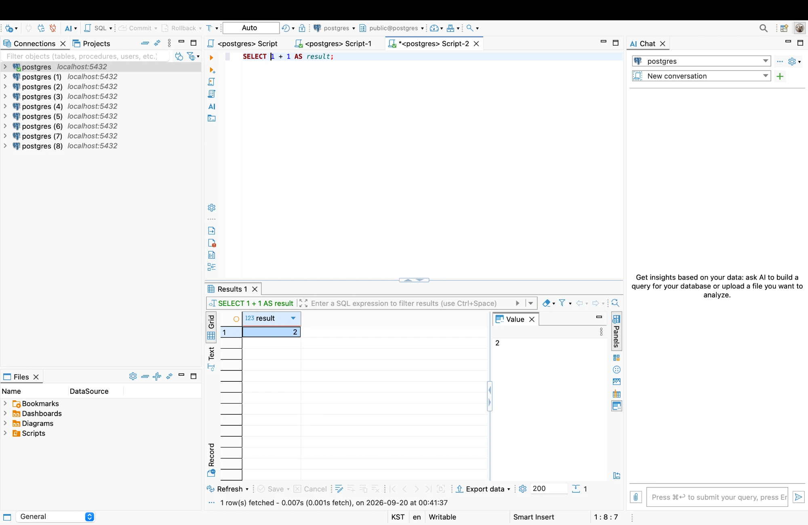
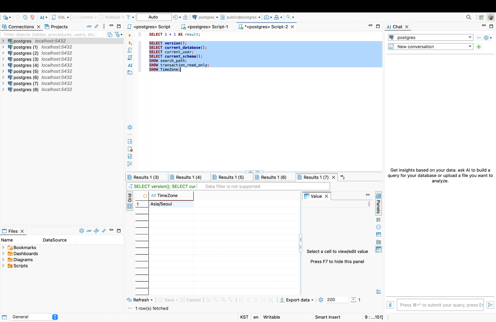
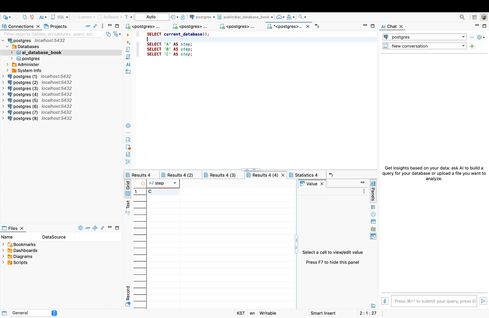
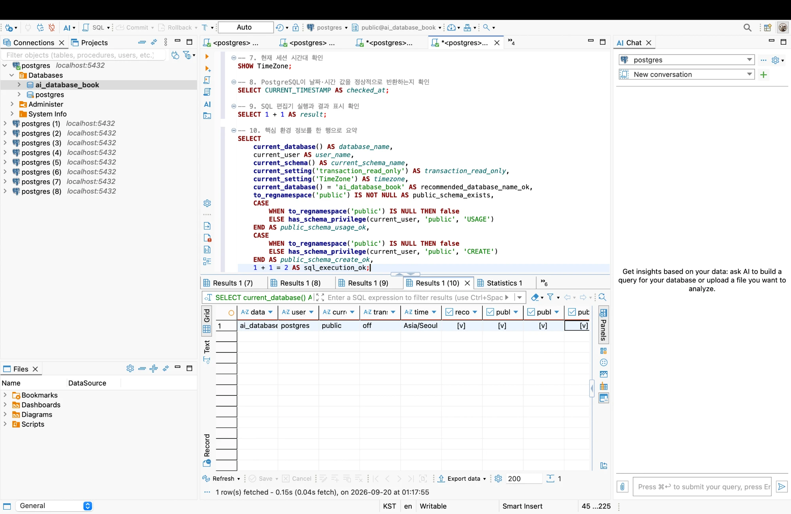
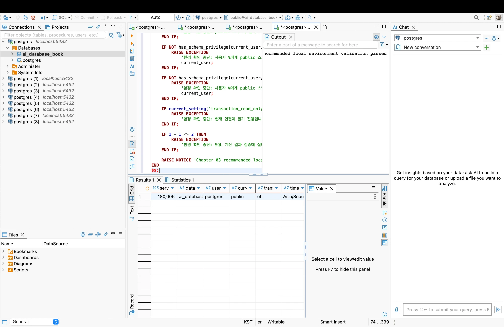

# Chapter 03 확장 실습 답안 템플릿

> **과제:** PostgreSQL과 DBeaver로 실습 환경 검증하기
> **사용 방법:** 이 파일을 내려받아 본인의 GitHub 저장소에 `chapter03_answer.md`라는 이름으로 저장한 뒤 실습하면서 바로 작성합니다.
> **제출 방법:** LMS에는 파일을 직접 업로드하지 않고, **본인 GitHub 저장소의 `chapter03_answer.md` 파일 URL**을 제출합니다.

---

## 제출 전 보안 주의

이 과제 파일과 캡처 화면에는 다음 정보를 올리지 않습니다.

```text
실제 PostgreSQL 비밀번호
전체 DB 접속 URL
API Key / Token
개인정보
공개할 필요가 없는 사내 서버 주소
```

LMS에서 제출자를 확인할 수 있으므로 공개 저장소의 답안 파일에 학번이나 실명을 반드시 적을 필요는 없습니다.

```text
GitHub 계정 또는 별칭: dusen120-ai
과제 작성일: 2026-09-20
사용한 AI 도구: Claude (Claude Code)
```

---

# 1. PostgreSQL과 DBeaver 환경 확인

## 1-1. 내 환경

| 항목 | 작성 내용 |
| --- | --- |
| 운영체제 | macOS (Darwin 24.6.0) |
| PostgreSQL 버전 | PostgreSQL 18.6 on aarch64-apple-darwin24.6.0 |
| DBeaver 버전 | 26.2.0 |
| Host | localhost |
| Port | 5432 |
| Database | postgres (연결 설정 화면 기준 — 실제 접속 DB는 3~4장에서 SQL로 재검증) |
| Username | postgres |

> 비밀번호는 기록하지 않습니다.

## 1-2. PostgreSQL과 DBeaver 역할 설명

```text
PostgreSQL은: 데이터를 저장하고 관리해주는 소프트웨어(DBMS, 데이터베이스 관리 시스템)이다. 실제 데이터와 테이블 구조가 저장되는 곳이다.

DBeaver는: PostgreSQL 서버에 접속해서 SQL을 실행하고 결과를 화면으로 보여주는 클라이언트(GUI) 프로그램이다. DBeaver 자체는 데이터를 저장하지 않는다.

두 프로그램의 차이는: PostgreSQL이 없으면 DBeaver만으로는 아무 데이터도 다룰 수 없다. DBeaver는 여러 개의 "연결(Connection)"을 만들어 동시에 여러 PostgreSQL 서버/데이터베이스에 접속할 수 있는데, 지금 내 왼쪽 Navigator에 postgres ~ postgres(8)까지 9개의 연결이 있는 것처럼, 연결은 여러 개 만들 수 있지만 그중 어떤 연결이 "지금 실제로 활성화되어 SQL을 실행하는 연결"인지는 화면 이름이 아니라 SQL로 확인해야 한다.
```

---

# 2. 연결 테스트와 첫 SQL

## 2-1. DBeaver 연결 결과

- [x] PostgreSQL 연결 유형 선택
- [x] Host 확인
- [x] Port 확인
- [x] Database 확인
- [x] Username 확인
- [x] Test Connection 성공

### 연결 성공 화면

권장 이미지 경로:

```text
assignments/chapter03/images/step02_connection.png
```



## 2-2. 첫 SQL 실행

```sql
SELECT 1 + 1 AS result;
```

실행 전 예상:

```text
result 컬럼에 2가 나올 것이라고 예상했다.
```

실제 결과:

```text
result = 2 (1 row(s) fetched - 0.007s)
```

이 결과가 의미하는 것:

```text
SQL 편집기가 실제로 PostgreSQL 서버에 연결되어 있고, 내가 입력한 SQL이 서버까지 전달되어 계산된 뒤 결과가 DBeaver 화면으로 정상적으로 돌아왔다는 것을 의미한다. 즉 "연결 성공" 아이콘만 초록불인 것이 아니라, 실제로 쿼리를 보내고 응답을 받는 왕복(round trip)이 정상 동작함을 확인한 것이다.
```

---

# 3. 현재 연결 위치를 SQL로 검증

다음 SQL을 실행합니다.

```sql
SELECT version();
SELECT current_database();
SELECT current_user;
SELECT current_schema();
SHOW search_path;
SHOW transaction_read_only;
SHOW TimeZone;
```

## 3-1. 결과 기록

| 확인 항목 | 실제 결과 | 내가 이해한 의미 |
| --- | --- | --- |
| `version()` | PostgreSQL 18.6 on aarch64-apple-darwin24.6.0, compiled by Apple clang 17.0.0, 64-bit | 서버 쪽에서 실제로 실행 중인 PostgreSQL 엔진의 버전. Homebrew로 설치한 psql 클라이언트(16.15)와 서버 버전이 다를 수 있다는 것도 알게 됐다. |
| `current_database()` | postgres | 지금 세션이 실제로 접속해서 SQL을 실행하고 있는 데이터베이스. 연결 설정 화면에 적힌 이름과 일치한다. |
| `current_user` | postgres | 이 세션이 어떤 역할(role)로 접속했는지. 이 사용자의 권한 범위 내에서만 SQL이 실행된다. |
| `current_schema()` | public | search_path 중에서 실제로 새 객체가 만들어지거나 이름 없이 참조될 때 우선 사용되는 스키마. |
| `search_path` | public, "$user" | PostgreSQL이 테이블 이름 등을 찾을 때 확인하는 스키마 순서. `$user`는 현재 사용자와 같은 이름의 스키마가 있으면 그것도 찾아보라는 의미이고, `current_schema()`가 `public`으로 나온 걸 보면 이 세션에는 `postgres`라는 이름의 스키마가 없어서 그다음 순서인 `public`이 선택된 것으로 보인다. |
| `transaction_read_only` | off | 이 세션이 읽기 전용이 아니라 실제로 데이터를 변경(INSERT/UPDATE/DELETE/CREATE 등)할 수 있는 상태라는 것. |
| `TimeZone` | Asia/Seoul | 이 세션에서 시간 관련 값(NOW(), CURRENT_TIMESTAMP 등)을 표시할 때 기준으로 쓰는 시간대. |

## 3-2. 반드시 설명할 것

### DBeaver 연결 이름과 `current_database()`는 왜 같은 개념이 아닌가요?

```text
DBeaver 연결 이름(Navigator에 보이는 postgres, postgres (1) ~ (8) 같은 라벨)은 내가(또는 예전의 내가) 임의로 붙인 이름표일 뿐이고, 실제로 그 연결이 어떤 서버·어떤 데이터베이스를 가리키는지는 연결 설정(Host/Port/Database)에 따로 저장되어 있다. 나처럼 연결이 9개나 있으면 이름만 보고는 그중 어떤 게 실제로 어떤 DB에 연결된 것인지 구분할 수 없다. current_database()는 화면의 이름표가 아니라, 지금 이 세션이 서버에 실제로 요청해서 받은 "진짜" 접속 대상 이름이기 때문에 신뢰할 수 있는 근거가 된다.
```

### `current_schema()`와 `search_path`는 어떤 관계가 있나요?

```text
search_path는 PostgreSQL이 스키마 이름을 생략했을 때 어떤 스키마들을 어떤 순서로 찾아볼지 정해놓은 목록이다. 내 경우 search_path가 `public, "$user"`로 나왔다. current_schema()는 이 목록 중에서 실제로 존재하고 사용 가능한 첫 번째 스키마 하나를 반환한 값이며, 내 경우 public이 나왔다. 즉 search_path는 "탐색 순서 전체"이고 current_schema()는 그중 "지금 실제로 채택된 1순위 결과"라는 관계이다.
```

### `transaction_read_only = off`라는 결과만으로 모든 테이블을 만들 권한이 있다고 단정할 수 있나요?

```text
아니다. transaction_read_only = off는 이 세션/트랜잭션 자체가 "읽기 전용 모드로 잠겨있지 않다"는 뜻일 뿐이다. 실제로 테이블을 만들 수 있으려면 그것과 별개로 현재 사용자(current_user)가 대상 스키마(예: public)에 대한 CREATE 권한을 가지고 있어야 한다. 이건 has_schema_privilege(current_user, 'public', 'CREATE') 같은 함수로 따로 확인해야 하는 부분이고, 6장의 setup_check.sql에서 이 값을 직접 확인해볼 것이다.
```

## 3-3. 증거 화면

권장 경로:

```text
assignments/chapter03/images/step03_location_check.png
```



---

# 4. `ai_database_book` 데이터베이스 확인

## 4-1. 현재 데이터베이스

```sql
SELECT current_database();
```

실제 결과:

```text
전환 전: postgres
재연결 후: ai_database_book
```

- [x] 결과가 `ai_database_book`이다. (연결 Database 설정 변경 + 재연결 후)
- [x] 다른 DB라면 올바른 연결로 전환했다.

## 4-2. 연결을 바꾼 뒤 다시 검증

```text
전환 전 데이터베이스: postgres (Edit Connection의 Main 탭 Database 필드도 postgres, SELECT current_database() 결과도 postgres였다)

전환 후 데이터베이스: ai_database_book

전환 여부를 판단한 근거: 처음엔 pg_database 카탈로그를 조회(SELECT datname FROM pg_database ...)해서 서버에 ai_database_book이 이미 존재한다는 걸 SQL로 확인했다. 그런데 DBeaver Navigator의 Databases 목록에는 그게 보이지 않아서 화면만으로는 존재 여부조차 알 수 없었다. 이후 연결 설정의 Database 값을 ai_database_book으로 바꿨는데도 곧바로 SELECT current_database()를 실행하니 여전히 postgres가 나왔다 — 설정 변경이 이미 맺어져 있던 세션에는 즉시 반영되지 않았기 때문이다. Disconnect 후 다시 Connect(재연결)해서 새 세션을 맺은 뒤에야 SELECT current_database()가 ai_database_book으로 바뀌었다. 즉 "연결이 바뀌었다"는 최종 판단은 설정 화면이나 Navigator가 아니라, 재연결 후 실제로 실행한 SQL 결과 하나로 내렸다.
```

### 화면에서 보이는 연결 이름만 믿지 않고 SQL을 다시 실행해야 하는 이유

```text
이번에 직접 겪은 두 가지 사례가 이유를 보여준다. 첫째, ai_database_book이 서버에 실제로 존재했는데도 DBeaver Navigator에는 표시되지 않았다 — 화면(UI)이 서버의 실제 상태를 항상 즉시, 정확히 반영하는 건 아니라는 것이다. 둘째, 연결 설정의 Database 값을 바꿔도 이미 열려 있는 세션은 그대로 예전 DB에 남아있었다 — 설정 화면에 적힌 값과 지금 이 세션이 실제로 물고 있는 값이 다를 수 있다는 것이다. 두 경우 모두 화면의 이름표만 봐서는 알 수 없었고, SELECT current_database()를 실제로 실행해서 서버가 되돌려주는 값을 확인하고 나서야 진짜 상태를 알 수 있었다. 그래서 "연결됐다/DB가 바뀌었다"는 판단은 UI 상태가 아니라 SQL 실행 결과를 근거로 내려야 한다.
```

---

# 5. SQL 실행 범위 실험

SQL Editor에 다음 세 문장을 입력합니다.

```sql
SELECT 'A' AS step;
SELECT 'B' AS step;
SELECT 'C' AS step;
```

## 5-1. 한 문장 실행

```text
내가 실행한 문장: SELECT 'B' AS step; (커서를 B 줄에 두고 Cmd+Return)
실제 결과: B 결과 탭 1개만 생성됨 (step = 'B')
```

## 5-2. 선택 영역 실행

```text
선택한 문장: SELECT 'A' AS step; 와 SELECT 'B' AS step; 두 줄을 Shift+클릭으로 정확히 선택한 뒤 Cmd+Return
실제 결과: A 결과 탭 1개, B 결과 탭 1개 — 선택한 범위 안의 문장 수만큼(2개) 결과 탭이 생성됨
```

## 5-3. 전체 스크립트 실행

```text
실제 결과: A, B, C 결과 탭이 각각 1개씩, 총 3개 생성됨
결과 탭 또는 실행 순서에서 관찰한 점: 편집기에 작성한 순서(위 A → 중간 B → 아래 C) 그대로 결과 탭이 생성됐다. 선택 영역을 지정하지 않아도 편집기 안의 모든 문장이 차례로 전부 실행됐다.
```

## 5-4. 결과 해석

```text
한 문장 실행과 전체 스크립트 실행의 차이: 한 문장 실행(Cmd+Return, 선택 없이 커서만 위치)은 커서가 있는 문장 딱 하나만 실행되고 결과 탭도 하나만 생긴다. 전체 스크립트 실행(Execute SQL Script)은 편집기 안의 모든 문장을 위에서부터 순서대로 하나씩 실행하고, 문장 개수만큼 결과 탭이 따로 생긴다. 선택 영역 실행은 그 중간 형태로, 내가 선택한 범위 안에 포함된 문장들만 순서대로 실행된다 — 5-2에서 A, B 두 줄만 선택했더니 정확히 그 두 문장만 실행되고 C는 실행되지 않았다.

변경 SQL에서 실행 범위를 잘못 선택하면 위험한 이유: 만약 SELECT 대신 UPDATE나 DELETE 문 여러 개가 같은 편집기 안에 함께 있는 상태에서, 의도한 문장 하나만 실행하려다가 실수로 전체를 선택하거나 전체 스크립트 실행을 눌러버리면, 아직 검토하지 않은 나머지 UPDATE/DELETE 문까지 전부 실행되어 의도하지 않은 데이터 변경이 일어날 수 있다. 반대로 전체를 실행해야 하는 상황에서 커서 위치의 한 문장만 실행해버리면, 뒤에 이어지는 문장들이 반영되지 않아 일부만 적용된 불완전한 상태로 남을 수 있다. 그래서 실행 버튼을 누르기 전에 지금이 "커서 위치 한 문장"인지 "선택 영역"인지 "전체 스크립트"인지를 항상 먼저 확인해야 한다.
```

### 증거 화면

권장 경로:

```text
assignments/chapter03/images/step05_execution_scope.png
```



---

# 6. 제공된 환경 확인 SQL 실행

Public 저장소의 Chapter 03 파일을 사용합니다.

```text
code/chapter03/setup_check.sql
code/chapter03/setup_validate_local.sql
```

## 6-1. `setup_check.sql`

실행 결과에서 확인한 항목:

```text
PostgreSQL 버전: PostgreSQL 18.6 on aarch64-apple-darwin24.6.0
현재 DB: ai_database_book
현재 사용자: postgres
현재 스키마: public
search_path: public, "$user"
읽기 전용 여부: off
TimeZone: Asia/Seoul
1 + 1 결과: 2
public 스키마 존재 여부: true
public USAGE 권한: true
public CREATE 권한: true
```

10번 요약 쿼리 결과 한 행: `database_name=ai_database_book, user_name=postgres, current_schema_name=public, transaction_read_only=off, timezone=Asia/Seoul, recommended_database_name_ok=true, public_schema_exists=true, public_schema_usage_ok=true, public_schema_create_ok=true` — 모든 체크 항목이 true로 나와서, 4장에서 DB를 전환한 뒤의 환경이 이 챕터가 기대하는 권장 로컬 조건을 실제로 만족한다는 것을 이 스크립트 하나로 다시 한번 확인했다.



### 이 파일을 여러 번 실행해도 비교적 안전한 이유

```text
setup_check.sql 안의 모든 문장이 SELECT / SHOW뿐이고 INSERT, UPDATE, DELETE, CREATE 같은 데이터나 구조를 바꾸는 명령이 하나도 없다. 즉 현재 상태를 "조회"만 할 뿐 아무것도 "변경"하지 않기 때문에, 몇 번을 반복 실행해도 매번 같은 조건이면 같은 결과가 나올 뿐 DB에 부작용(side effect)이 남지 않는다.
```

## 6-2. `setup_validate_local.sql`

```text
실행 결과: Output 탭에 "NOTICE: Chapter 03 recommended local environment validation passed" 메시지 출력됨. 앞의 SELECT 결과에서도 server_version_num=180006, database_name=ai_database_book, user=postgres, current_schema=public, transaction_read_only=off, timezone=Asia/Seoul 확인됨.
PASS / FAIL: PASS
```

실패했다면 실패 항목:

```text
(해당 없음 — 이번 실행은 PASS)
```

그 실패가 실제 문제인지 환경 차이인지 판단한 근거:

```text
이번엔 실패가 없었지만, 만약 실패했다면 이 스크립트의 RAISE EXCEPTION 메시지 자체가 "무엇이 왜 조건을 만족하지 못했는지"를 구체적으로 알려주기 때문에(예: 현재 데이터베이스가 무엇인지, 어떤 권한이 없는지) 그 메시지 문구를 근거로 실제 설정 문제인지, 아니면 이 책이 가정하는 "권장 로컬 환경"과 다른 관리형 환경이라 애초에 이 조건이 안 맞는 상황인지를 구분했을 것이다. 지금은 4장에서 겪었던 것처럼 DB 전환이 실제로는 됐는지 SQL로 재검증했고, 6-1에서 이미 모든 조건이 true로 나온 뒤라 이 스크립트도 통과할 거라 예상했는데 실제로 그렇게 나왔다.
```



---

# 7. 안전한 오류 진단 실습

실제 오류가 있었다면 그 오류를 사용합니다. 오류가 없었다면 **데이터를 삭제하거나 서버를 강제로 중지하지 말고**, 안전한 SQL 문법 오류를 하나 만들어 관찰합니다.

예:

```sql
SELEC 1;
```

> 오류를 확인한 뒤 올바른 `SELECT 1;`로 복구합니다.

## 7-1. 오류 기록

```text
오류 메시지 핵심 문장: SQL Error [42601]: ERROR: syntax error at or near "SELEC" / Position: 1

내가 먼저 생각한 원인 1: 1이라는 값이 없어서 오류가 난 것 같다고 생각했다.

내가 먼저 생각한 원인 2: (바로 떠오르지 않아서 AI에게 Position: 1의 의미를 물어봤다)

실제로 확인한 방법: 오류 메시지의 각 부분을 하나씩 뜯어봤다. "syntax error at or near \"SELEC\""에서 따옴표 안에 있는 게 정확히 내가 오타를 낸 키워드 SELEC이라는 걸 확인했고, "Position: 1"이 SQL 안의 숫자 1이 아니라 문장에서 문제가 시작된 문자 위치(=1번째 글자)를 가리킨다는 걸 AI 설명을 듣고 확인했다.

실제 원인: SELECT를 SELEC으로 잘못 입력한 키워드 오타. PostgreSQL 파서가 문장 맨 앞 단어를 자신이 아는 SQL 명령어 목록과 비교하는데, SELEC은 그 목록에 없어서 문장이 시작되자마자(1번째 글자에서) 파싱이 실패했다.

수정한 내용: SELEC 1; → SELECT 1;로 철자를 고쳤다.
```

## 7-2. 수정 후 재검증

```sql
SELECT 1;
SELECT current_database();
```

```text
재검증 결과: SELECT 1; → 1 정상 반환. SELECT current_database(); → ai_database_book 정상 반환. 오타를 고치자 두 문장 모두 오류 없이 실행됐고, 여전히 ai_database_book에 연결된 상태가 유지되고 있음도 함께 확인됐다.
```

## 7-3. 오류를 유형으로 분류

- [ ] 서버 실행 문제
- [ ] Host 문제
- [ ] Port 문제
- [ ] Database 문제
- [ ] Username/인증 문제
- [x] SQL 문법 문제
- [ ] 권한 문제
- [ ] 기타

선택 이유:

```text
이미 ai_database_book에 정상적으로 연결되어 있었고(서버/Host/Port/Database/Username 모두 문제없이 통과한 상태), SQL 편집기에서 문장을 실행하려는 시점에만 오류가 났다. 오류 메시지도 "syntax error"라고 명확히 SQL 문법 문제라고 밝히고 있었고, 오타(SELEC → SELECT)를 고치자 바로 해결됐다. 연결/권한 관련 오류였다면 has_schema_privilege 관련 메시지나 인증 실패 메시지가 나왔을 텐데 그런 내용은 전혀 없었다.
```

---

# 8. AI를 오류 분석 보조 도구로 사용

## 8-1. AI에게 전달한 프롬프트

비밀번호·개인정보·전체 접속 URL은 제거하고 기록합니다.

```text
1) "SQL Error [42601]: ERROR: syntax error at or near "SELEC" Position: 1 이렇게 떠. 내가 생각한 원인은 1 이라는게 없어서?" (SELEC 1; 실행 후 뜬 오류를 그대로 붙여넣고, 내가 생각한 원인을 같이 물어봄)

2) (앞서 4장에서는) "뭐지 ai_database_book은 이미 있다는데 databases 하위 목록에는 안떠" (CREATE DATABASE 시도 후 나온 duplicate 오류와 Navigator에 안 보이는 현상을 그대로 전달)
```

## 8-2. AI 답변 검토

| AI가 제안한 확인 방법 | 실제로 확인했는가? | 결과 | 수용 / 수정 / 거절 |
| --- | --- | --- | --- |
| Position: 1은 값이 아니라 오류가 시작된 문자 위치라는 설명, SELEC은 SQL 키워드 오타이므로 SELECT로 고치라는 제안 | O (SELECT 1; SELECT current_database(); 재실행) | 둘 다 정상 실행됨 (1, ai_database_book 반환) | 수용 |
| (DB 존재 안 함을 전제로) `CREATE DATABASE ai_database_book;` 실행해서 새로 만들라는 제안 | O (실제로 실행해봄) | "이미 존재한다"는 오류가 나서 AI의 전제(DB가 없다)가 틀렸다는 게 드러남 | 수정 — 전제를 다시 세우고 `SELECT datname FROM pg_database ...`로 서버에 실제로 존재하는지부터 재확인함 |
| Edit Connection의 Database 값만 바꾸면 바로 전환될 것이라는 설명 | O (바꾼 직후 SELECT current_database() 실행) | 여전히 postgres로 나옴 → 예상과 다름 | 수정 — Disconnect/Connect(재연결)까지 해야 실제로 반영된다는 걸 추가로 확인함 |

### AI가 오류 원인을 너무 빨리 단정한 부분이 있었나요?

```text
있었다. 4장에서 current_database()가 postgres로 나온 것과 pg_database 조회 결과만 보고, AI(나)는 "ai_database_book이 서버에 아예 없으니 CREATE DATABASE로 새로 만들면 된다"고 바로 제안했다. 그런데 실제로 실행해보니 "이미 존재한다"는 오류가 났고, 알고 보니 DBeaver Navigator가 그 DB를 표시하지 않고 있었을 뿐이었다. AI의 첫 판단은 "화면/쿼리 결과에 안 보인다 = 존재하지 않는다"는 성급한 결론이었고, 실제로는 표시 문제와 실체 존재 여부가 달랐다.
```

### 오류 메시지와 실제 환경 중 무엇을 확인해서 최종 판단했나요?

```text
최종적으로는 항상 실제 환경(SQL 실행 결과)을 기준으로 판단했다. SELEC 오류는 메시지 문구(syntax error, Position)를 근거로 원인을 좁혔지만, 4장의 DB 존재 여부는 메시지나 화면 대신 SELECT datname FROM pg_database ...를 직접 실행한 결과로 최종 판단했다. AI의 설명이나 제안도 결국은 내가 직접 SQL을 실행해서 맞는지 틀린지 확인한 뒤에만 답안에 반영했다.
```

### AI 활용에서 가장 유용했던 점

```text
오류 메시지 안의 각 구성 요소(예: "syntax error at or near", "Position:")가 각각 무엇을 의미하는지 빠르게 풀어서 설명해준 점, 그리고 다음에 무엇을 실행해서 확인해보면 되는지 구체적인 SQL을 바로 제시해준 점이 가장 유용했다. 특히 "화면에 안 보이는 것"과 "실제로 존재하지 않는 것"이 다를 수 있다는 걸, AI의 잘못된 첫 제안(CREATE DATABASE)이 실패하는 과정을 통해 오히려 더 확실하게 체감할 수 있었다.
```

### AI 답변을 그대로 실행하지 않고 확인해야 하는 이유

```text
이번 실습에서 AI가 제안한 CREATE DATABASE ai_database_book;을 별 의심 없이 그대로 실행했다면 "이미 존재합니다" 오류만 만나고 끝났을 수도 있었다. 하지만 그 오류 자체가 AI의 전제가 틀렸다는 새로운 증거가 됐고, 그걸 바탕으로 pg_database를 직접 조회해서 진짜 상태를 확인하는 다음 단계로 넘어갈 수 있었다. 즉 AI의 제안은 "다음에 무엇을 시도해볼지"에 대한 좋은 출발점이 되지만, 그 결과가 예상과 다르게 나올 수 있고 그 차이 자체가 중요한 정보이기 때문에, 실행하고 결과를 직접 눈으로 확인하는 과정을 생략하면 안 된다.
```

---

# 9. Chapter 01~02 개인 서비스와 연결

앞에서 선택한 개인 서비스가 PostgreSQL을 사용한다고 가정합니다.

```text
서비스 이름: 내 카페 방문 기록

사용할 데이터베이스 이름 후보: my_cafe_log (오늘 실습으로는 ai_database_book 안에 스키마로 구분해서 넣는 것도 가능하다는 걸 알게 됐다)

사용할 스키마 이름 후보: public (또는 별도로 cafe_log 스키마를 만들어 분리할 수도 있다)

앞으로 만들고 싶은 테이블 후보 3개:
1. cafes — 카페 한 곳에 대한 정보
2. visits — 내가 카페를 방문한 기록 한 번
3. menu_items — 마셔보거나 먹어본 메뉴 한 개 (Chapter 02 AI 검토를 통해 drink_menu/dessert_menu를 category 컬럼으로 합친 버전)
```

### 아직 SQL을 만들지 않고 이름과 역할만 정하는 이유

```text
Chapter 03에서 확인했듯, DB/스키마 연결 상태를 화면만 보고 믿으면 안 되고 SQL로 직접 검증해야 한다. 아직 current_database()/current_schema()가 어떤 환경을 가리킬지, 그리고 이 개인 서비스를 ai_database_book 안에 넣을지 별도 DB로 분리할지도 확정하지 않았기 때문에, 지금 바로 CREATE TABLE을 실행하면 의도와 다른 위치(예: 잘못된 스키마)에 테이블이 생길 위험이 있다. 그래서 이름과 역할만 먼저 정리하고, 실제 생성은 연결 위치를 다시 한번 확인한 뒤로 미룬다.
```

### Chapter 02에서 정리했던 한 행의 의미 중 수정할 부분이 있나요?

```text
Chapter 02에서는 cafes.my_rating(전체 선호도)을 방문별 rating과 별개로 직접 입력할지, 평균으로 자동 계산할지 미확정으로 남겨뒀었다. 이번 Chapter 03에서 오류를 실제로 진단해보면서, 앞으로 규칙(제약조건, 계산 로직)을 SQL로 구현할 때도 "그럴 것이다"라고 짐작하지 말고 직접 실행해서 결과를 확인해야 한다는 걸 다시 느꼈다. 그래서 이 부분은 아직 확정하지 않고, Chapter 04~05에서 실제로 만들어보면서 결정하기로 한다.
```

---

# 10. 초보자용 연결 가이드 작성

친구가 자신의 PC에서 같은 실습을 시작한다고 가정합니다. 아래 순서를 자신의 말로 작성합니다.

```text
1. PostgreSQL 서버가 실행되는지 확인하는 방법:
터미널에서 pg_isready를 실행하면 서버가 접속을 받고 있는지 바로 알 수 있다. macOS에서 Homebrew로 설치했다면 brew services list로 postgresql 서비스가 started 상태인지도 확인할 수 있다.

2. DBeaver에서 PostgreSQL 연결을 만드는 방법:
새 연결 만들기 아이콘을 누르고 PostgreSQL을 선택한 뒤, Host/Port/Database/Username/Password를 입력하고 Test Connection으로 성공 여부를 확인한 다음 저장한다.

3. Host / Port / Database / Username의 의미:
Host는 PostgreSQL 서버가 실행 중인 컴퓨터 주소(로컬이면 localhost), Port는 그 컴퓨터에서 PostgreSQL이 듣고 있는 통신 문(기본 5432), Database는 서버 안에서 실제로 접속해 SQL을 실행할 논리적 데이터베이스 이름, Username은 그 서버에 접속하는 계정(역할)이다.

4. ai_database_book에 연결되었는지 확인하는 방법:
연결 설정 화면이나 Navigator에 적힌 이름을 보지 말고, SQL 편집기에서 SELECT current_database();를 직접 실행해서 그 결과가 ai_database_book으로 나오는지 확인해야 한다.

5. 현재 위치를 확인하는 SQL:
SELECT current_database(); SELECT current_user; SELECT current_schema(); SHOW search_path;

6. 한 문장과 전체 스크립트 실행을 구분해야 하는 이유:
한 문장 실행은 커서가 있는 문장 하나만, 전체 스크립트 실행은 편집기 안의 모든 문장을 순서대로 다 실행한다. 특히 데이터를 바꾸는 SQL(UPDATE, DELETE 등)이 여러 개 같이 있을 때 이 둘을 헷갈리면, 검토하지 않은 문장까지 실행되거나 반대로 필요한 문장이 실행되지 않을 수 있다.

7. 비밀번호를 GitHub나 AI 프롬프트에 넣으면 안 되는 이유:
GitHub 공개 저장소나 AI 대화 내용은 나중에 다른 사람이나 다른 서비스에 노출될 수 있다. 비밀번호가 한 번이라도 텍스트로 어딘가에 올라가면, 그 저장소나 대화 기록을 지워도 이미 캐시되거나 복사됐을 수 있어 완전히 회수하기 어렵다. 그래서 처음부터 실제 비밀번호는 어디에도 입력하지 않는 게 안전하다.
```

---

# 11. 최종 성찰

아래 문장은 반드시 본인의 말로 작성합니다.

```text
1. DBeaver와 PostgreSQL의 가장 중요한 차이는
   DBeaver는 서버에 접속해 SQL을 보내고 결과를 보여주는 클라이언트일 뿐이고, 실제 데이터와 구조를 저장·관리하는 것은 PostgreSQL 서버라는 것 이다.

2. 내가 지금 어느 데이터베이스에 연결되어 있는지 확인할 때
   화면 이름만 보지 않고 SELECT current_database();를 직접 실행해서 서버가 돌려주는 값을 확인 해야 한다.

3. PostgreSQL 오류가 발생했을 때 가장 먼저 해야 할 일은
   오류 메시지 전체(코드, 문구, Position 등)를 끝까지 읽고 어떤 유형(문법/연결/권한 등)의 문제인지부터 구분하는 것 이다.

4. AI를 오류 해결에 사용할 때 가장 중요한 것은
   AI의 제안을 결론이 아니라 다음에 시도해볼 가설로 받아들이고, 실제로 실행해서 나온 결과로 그 가설이 맞았는지 다시 검증하는 것 이다.
```

---

# 12. 제출 체크리스트

- [x] `chapter03_answer.md`의 빈 필수 항목을 작성했다.
- [x] PostgreSQL과 DBeaver의 역할 차이를 설명했다.
- [x] `current_database/current_user/current_schema/search_path`를 실제로 확인했다.
- [x] `ai_database_book` 연결 여부를 SQL로 검증했다.
- [x] SQL 실행 범위 세 가지를 비교했다.
- [x] `setup_check.sql`을 실행했다.
- [x] `setup_validate_local.sql` 결과를 확인했다.
- [x] 오류 원인을 먼저 스스로 추정한 뒤 AI를 사용했다.
- [x] AI 제안을 실제 환경에서 검증했다.
- [x] 핵심 캡처 5장을 골라 넣었다.
- [x] 캡처에 비밀번호·개인정보·전체 접속 URL이 없다.
- [ ] Markdown 이미지가 GitHub 웹 화면에서 실제로 보인다.
- [ ] 최종 답안 파일을 commit/push했다.

---

# 13. LMS 제출 URL

아래 형식의 **본인 GitHub 파일 URL**을 LMS에 제출합니다.

```text
https://github.com/<본인-GitHub-ID>/<본인-저장소>/blob/main/assignments/chapter03/chapter03_answer.md
```

내 제출 URL:

```text

```

> 저장소 메인 URL, 교수자 템플릿 URL, Raw URL이 아니라 **작성 완료된 본인 `chapter03_answer.md` 파일 화면 URL**을 제출합니다.
