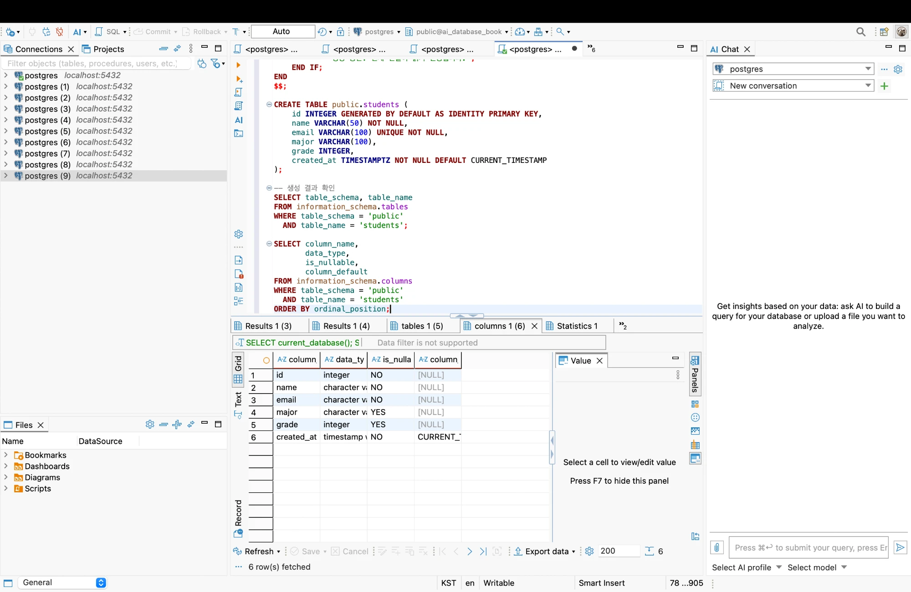
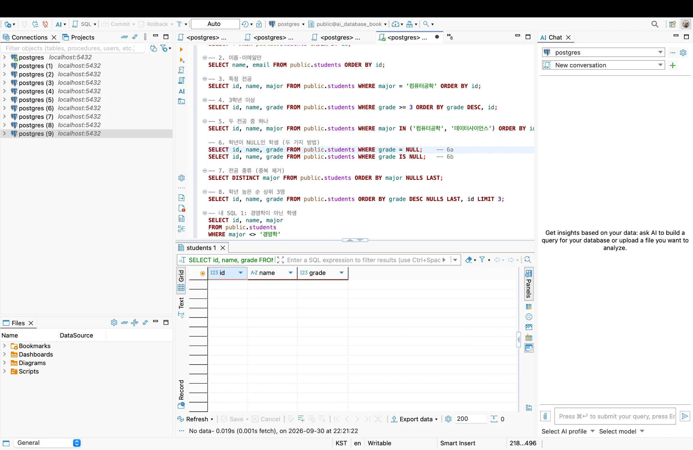
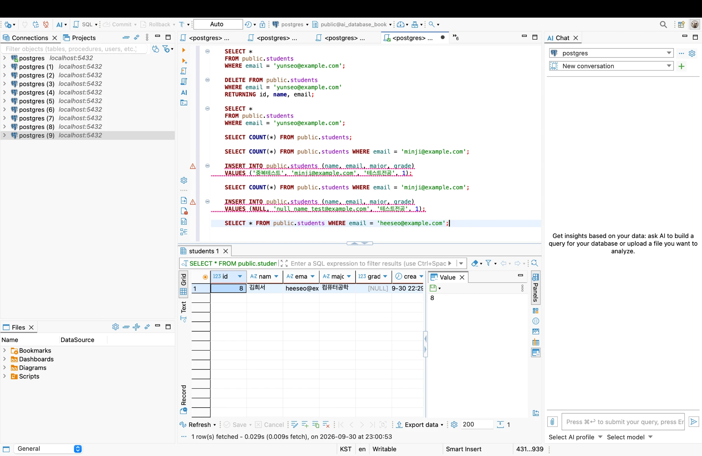
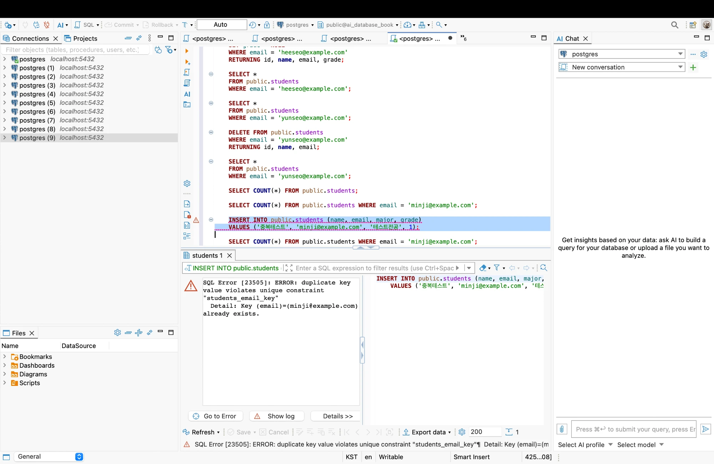
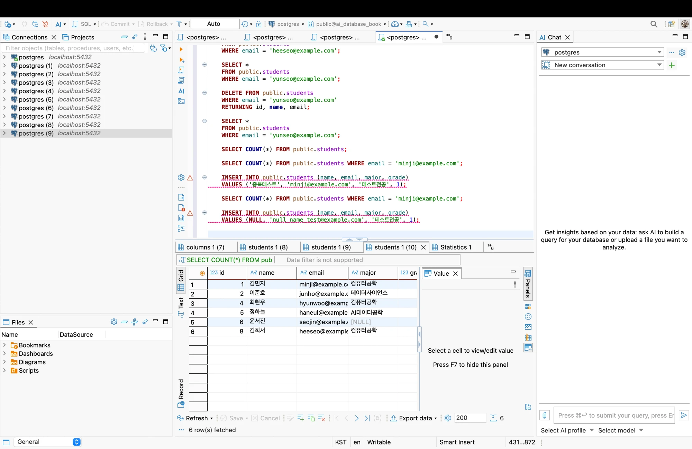

# Chapter 04 확장 실습 답안 템플릿

> **과제:** 관계형 데이터베이스와 SQL 시작하기  
> **사용 방법:** 이 파일을 내려받아 본인의 GitHub 저장소에 `chapter04_answer.md`라는 이름으로 저장한 뒤 실습하면서 바로 작성합니다.  
> **제출 방법:** LMS에는 파일을 직접 업로드하지 않고, **본인 GitHub 저장소의 `chapter04_answer.md` 파일 URL**을 제출합니다.

---

## 제출 전 주의

이 파일과 캡처 화면에는 실제 비밀번호, 전체 DB 접속 URL, API Key, 개인정보를 기록하지 않습니다.

```text
GitHub 계정 또는 별칭: dusen120-ai
과제 작성일: 2026-09-30
사용한 AI 도구: Claude (Claude Code)
```

---

# 1. 실습 환경과 시작 상태 확인

다음을 실행합니다.

```sql
SELECT current_database();
SELECT current_user;
SELECT current_schema();
SHOW search_path;
SHOW transaction_read_only;
```

| 확인 항목 | 실제 결과 | 의미 |
| --- | --- | --- |
| current_database() | ai_database_book | 지금 이 세션이 실제로 SQL을 실행하는 DB. 교재가 요구하는 실습 DB가 맞다. |
| current_user | postgres | 이 역할(role)의 권한 범위 안에서 SQL이 실행된다. |
| current_schema() | public | 스키마를 생략한 이름이 해석되는 스키마. 교재 SQL은 `public.students`처럼 스키마를 명시한다. |
| search_path | public, "$user" | 테이블 이름을 찾을 때 확인하는 스키마 목록. `postgres`라는 스키마가 없으므로 실제로는 `public`에서 찾는다. |
| transaction_read_only | off | 읽기 전용이 아니므로 CREATE/INSERT/UPDATE/DELETE가 가능한 연결이다. |

- [x] 현재 DB가 `ai_database_book`이다.
- [x] 변경 가능한 연결인지 확인했다.
- [x] 실행할 SQL 범위를 확인했다.
- [x] Auto-commit 상태를 확인했다. (DBeaver 툴바: Auto)

### 변경 SQL을 실행하기 전에 현재 DB와 실행 범위를 확인해야 하는 이유

```text
변경 SQL은 지금 연결된 DB에 바로 적용되므로, 확인하지 않으면 의도하지 않은 다른 DB에 잘못 적용될 수 있기 때문이다.
또 스크립트 전체 실행(⌥+X)과 한 문장 실행(⌘+Enter)은 실행되는 범위가 다르고,
Auto-commit 상태에서는 실행 즉시 확정되므로 실행 전에 대상 DB와 범위를 먼저 확인해야 한다.
```

---

# 2. `public.students` 구조 생성

## 2-1. 실행 전 예상

```text
테이블 이름: public.students
한 행의 의미: 학생 한 명의 정보
예상 행 수: 5
기본키: id
필수 열: 3개
중복을 막는 열: email
자동 생성 열: id
```

## 2-2. 실행 파일

```text
code/chapter04/01_create_students.sql
```

## 2-3. 실행 후 확인

```text
테이블 생성 성공 여부: 성공 (information_schema.columns 조회 결과 6개 열 확인)
실제 행 수: 0 (SELECT COUNT(*) FROM public.students; → 0)
DBeaver에서 확인한 위치: ai_database_book > Schemas > public > Tables > students
```

### 예상과 실제 비교

```text
예상 행 수 5 → 실제 0: CREATE TABLE은 열 구조(틀)만 만들고 데이터는 넣지 않는다. 행은 INSERT를 해야 생긴다.
필수 열 3개 → 실제 4개 (id, name, email, created_at): id에는 NOT NULL이 직접 적혀 있지 않지만
  PRIMARY KEY는 자동으로 NOT NULL이 되기 때문에 is_nullable = NO로 나왔다.
자동 생성 열 id → 실제 id, created_at: created_at도 DEFAULT CURRENT_TIMESTAMP가 있어서 값을 넣지 않으면
  DB가 현재 시각으로 채운다. (column_default 칸에 CURRENT_TIMESTAMP로 표시됨)
기본키 id, 중복을 막는 열 email → 예상과 일치
```

### 각 열의 역할

| 열 | 타입 | NULL 가능? | 역할 |
| --- | --- | --- | --- |
| id | integer (IDENTITY) | NO | 기본키. DB가 자동으로 붙이는 내부 식별 번호 |
| name | varchar(50) | NO | 학생 이름. 반드시 입력해야 함 |
| email | varchar(100) | NO | 학생 이메일. UNIQUE라서 같은 이메일을 두 번 넣을 수 없음 |
| major | varchar(100) | YES | 전공. 모르면 비워 둘 수 있음 |
| grade | integer | YES | 학년. 모르면 비워 둘 수 있음 |
| created_at | timestamptz | NO | 행이 입력된 시각. 값을 안 넣으면 현재 시각이 자동으로 들어감 |

### `id`를 학번이나 학생 수로 해석하면 안 되는 이유

```text
id는 학교가 부여한 학번이 아니라 DB가 행을 구분하려고 자동으로 붙인 번호일 뿐이다.
또 중간 학생을 삭제하면 그 번호는 다시 채워지지 않고 빈 번호로 남기 때문에,
마지막 id 값이 곧 학생 수라고 볼 수 없다. 학생 수는 COUNT(*)로 확인해야 한다.
```

### 증거 화면

권장 경로:

```text
assignments/chapter04/images/step02_table.png
```



---

# 3. 샘플 데이터 6명 입력

## 3-1. 실행 전 예상

```text
현재 행 수: 0
실행 후 예상 행 수: 6
예상되는 NULL 포함 학생: 윤서진 (major, grade를 입력하지 않았으므로 NULL)
```

## 3-2. 실행 파일

```text
code/chapter04/02_insert_students.sql
```

## 3-3. 실제 결과

```text
실제 행 수: 6
이준호 grade: 3
박서연 존재 여부: 있음
윤서진 major: NULL
윤서진 grade: NULL
```

### 예상과 실제 비교

```text
예상과 실제가 일치했는가: 일치 (행 수 6, NULL 포함 학생은 윤서진의 major·grade)
다르다면 이유: 해당 없음
```

### `created_at` 값이 여러 행에서 같을 수 있는 이유

```text
CURRENT_TIMESTAMP는 각 INSERT 문장이 실행된 순간이 아니라, 트랜잭션(BEGIN ~ COMMIT 하나의 묶음)이
시작된 시각을 돌려준다. 02_insert_students.sql은 INSERT 세 번을 하나의 트랜잭션으로 묶었기 때문에
6명 모두 created_at이 같은 값으로 저장되었다.
```

---

# 4. SELECT 복습과 결과 검증

각 문제는 **SQL 실행 전에 예상 행 수를 먼저 작성**합니다.

| 번호 | 조회 문제 | 예상 행 수 | 실제 행 수 | 일치? | 다르면 이유 |
| ---: | --- | ---: | ---: | --- | --- |
| 1 | 전체 학생 | 6 | 6 | O |  |
| 2 | 이름·이메일만 조회 | 6 | 6 | O | 열만 줄고 행 수는 그대로 |
| 3 | 특정 전공 (`major = '컴퓨터공학'`) | 3 (id 1, 4, 6) | 2 (id 1, 4) | X | 윤서진(id 6)은 major가 NULL이라 `= '컴퓨터공학'` 비교 결과가 참이 아니므로 제외된다. |
| 4 | 특정 학년 이상 (`grade >= 3`) | 3 (id 2, 4, 6) | 2 (id 4, 2) | X | 윤서진의 grade가 NULL이라 `NULL >= 3`이 참이 아니므로 제외된다. |
| 5 | 두 전공 중 하나 (`IN ('컴퓨터공학','데이터사이언스')`) | 4 (id 1, 2, 4, 6) | 3 (id 1, 2, 4) | X | 3·4번과 같은 이유로 NULL인 윤서진은 IN 목록 어느 값과도 일치하지 않는다. |
| 6 | `grade IS NULL` | `= NULL`과 결과가 다를 것 | `= NULL`: 0행 / `IS NULL`: 1행 (윤서진) | O | 예상대로 두 결과가 달랐다. |
| 7 | 전공 `DISTINCT` | 5 (NULL도 한 종류) | 5 | O | 전공 4종류 + NULL 1개 |
| 8 | 정렬 후 상위 3명 (`ORDER BY grade DESC NULLS LAST, id LIMIT 3`) | 4 (id 4, 2, 1, 3) | 3 (id 4, 2, 1) | X | 순서(4→2→1)는 맞았지만 LIMIT 3이 결과를 3행으로 자른다. |

## 4-1. 내가 직접 작성한 SQL 2개

```sql
-- SQL 1: 경영학이 아닌 학생
SELECT id, name, major
FROM public.students
WHERE major <> '경영학'
ORDER BY id;
```

```text
질문: 전공이 경영학이 아닌 학생은 누구인가?
이 SQL의 한 행 의미: 전공이 경영학이 아닌 학생 한 명
예상 행 수: 4
실제 행 수: 4 (id 1, 2, 4, 5)
결과 해석: 경영학인 박서연(id 3)이 빠졌고, 전공이 NULL인 윤서진(id 6)도 빠졌다.
           NULL <> '경영학'은 참이 아니라 UNKNOWN이기 때문이다.
           전공이 없는 학생까지 포함하려면 WHERE major <> '경영학' OR major IS NULL로 써야 한다.
```

```sql
-- SQL 2: 2학년 이하인 학생
SELECT id, name, grade
FROM public.students
WHERE grade <= 2
ORDER BY id;
```

```text
질문: 2학년 이하인 학생은 누구인가?
이 SQL의 한 행 의미: 2학년 이하인 학생 한 명
예상 행 수: 3
실제 행 수: 3 (id 1, 3, 5)
결과 해석: 김민지(2), 박서연(1), 정하늘(2)이 나왔다. 학년이 NULL인 윤서진은 NULL <= 2가 UNKNOWN이라
           제외되었다. 학년 정보가 없는 학생도 포함하려면 WHERE grade <= 2 OR grade IS NULL로 써야 한다.
```

## 4-2. `= NULL` 대신 `IS NULL`을 사용하는 이유

```text
NULL은 'NULL'이라는 값이 아니라 값이 없는(모르는) 상태다. 그래서 grade = NULL처럼 비교하면
어떤 행이든 결과가 참도 거짓도 아닌 UNKNOWN이 되고, WHERE는 참인 행만 돌려주므로 0행이 나온다.
(실제 결과: grade = NULL → 0행, grade IS NULL → 윤서진 1행)
오류 없이 조용히 0행이 나오기 때문에 더 위험하다. 값이 없는 상태인지 확인하려면 IS NULL을 사용해야 한다.
```

## 4-3. `ORDER BY` 없이 결과 순서를 믿으면 안 되는 이유

```text
테이블의 행에는 정해진 순서가 없다. ORDER BY가 없으면 DB가 편한 순서로 돌려줄 뿐이라,
지금은 입력 순서처럼 보여도 데이터가 수정·삭제되면 순서가 달라질 수 있다.
특히 8번처럼 LIMIT으로 상위 몇 명을 고를 때 ORDER BY가 없으면 어떤 행이 나올지 보장되지 않는다.
```

## 4-4. `DISTINCT`가 원본 데이터를 삭제하는 기능인가요?

```text
아니다. DISTINCT는 조회 결과에서 중복된 값을 한 번만 보여 줄 뿐, 테이블의 데이터를 삭제하지 않는다.
DISTINCT major 결과는 5행이었지만 students 테이블에는 여전히 6명이 그대로 있다.
```

### 증거 화면

권장 경로:

```text
assignments/chapter04/images/step04_select.png
```

`WHERE grade = NULL` → No data (0행). 같은 조건을 `WHERE grade IS NULL`로 쓰면 1행(윤서진)이 나왔다.



---

# 5. 내 가상 학생 2명 추가

실명·실제 이메일 대신 가상 데이터를 사용합니다.

## 5-1. 실행 전 계획

```text
학생 A
이름: 최윤서
이메일: yunseo@example.com
전공: 영어영문
학년: 4

학생 B
이름: 김희서
이메일: heeseo@example.com
전공: 컴퓨터공학
학년 또는 NULL: 4

현재 행 수: 5 (샘플 6명 - 8번에서 삭제한 박서연 1명)
추가 후 예상 행 수: 7
```

## 5-2. 내가 실행한 INSERT

```sql
INSERT INTO public.students (name, email, major, grade)
VALUES
    ('최윤서', 'yunseo@example.com', '영어영문', 4),
    ('김희서', 'heeseo@example.com', '컴퓨터공학', 4)
RETURNING id, name, email, major, grade;
```

## 5-3. 실제 결과

```text
RETURNING 또는 확인 SELECT 결과: 최윤서 id 7, 김희서 id 8로 2행 입력됨
실제 전체 행 수: 7 (실행 전 5 → 실행 후 7)
예상과 일치 여부: 일치
참고: 삭제된 박서연의 id 3은 다시 채워지지 않고, 새 학생은 7번부터 번호를 받았다.
```

### 내가 일부 값을 NULL로 둔 이유 또는 NULL을 사용하지 않은 이유

```text
두 학생의 이름, 이메일, 전공, 학년을 모두 알고 있어서 NULL을 사용하지 않았다.
NULL은 값을 모를 때 쓰는 것이므로, 아는 값은 그대로 넣는 것이 맞다.
```

---

# 6. 안전한 UPDATE

내가 추가한 가상 학생 한 명만 수정합니다.

## 6-1. 먼저 대상 확인 SELECT

처음에는 김희서의 학년(4)으로 대상을 고르려 했다.

```sql
-- 1차 시도 (UPDATE 전에 SELECT로 먼저 확인)
SELECT *
FROM public.students
WHERE grade = 4;
```

```text
예상 대상 행 수: 3
실제 대상 행 수: 4 (이준호, 최현우, 최윤서, 김희서)
→ 8번에서 이준호의 학년이 3 → 4로 바뀐 것을 잊고 있었다.
  이 조건으로 바로 UPDATE했다면 김희서 1명이 아니라 4명의 학년이 모두 NULL이 되었을 것이다.
  그래서 UNIQUE 제약이 있는 email로 조건을 바꿨다.
```

```sql
-- 2차 시도 (조건 수정)
SELECT *
FROM public.students
WHERE email = 'heeseo@example.com';
```

```text
예상 대상 행 수: 1
실제 대상 행 수: 1 (김희서)
```

## 6-2. UPDATE

```sql
UPDATE public.students
SET grade = NULL
WHERE email = 'heeseo@example.com'
RETURNING id, name, email, grade;
```

```text
예상 영향 행 수: 1
실제 영향 행 수: 1
RETURNING 결과: 8 | 김희서 | heeseo@example.com | NULL
```

## 6-3. UPDATE 후 재조회

```sql
SELECT *
FROM public.students
WHERE email = 'heeseo@example.com';
```

```text
결과: 1행, 김희서의 grade가 4 → NULL로 바뀐 것을 확인했다.
```

### `WHERE` 없는 UPDATE를 실행하면 위험한 이유

```text
WHERE가 없으면 테이블의 전체 행이 한꺼번에 바뀌는데, 오류가 아니라 성공 메시지가 나오기 때문에
실수를 바로 알아채기 어렵다. 게다가 Auto-commit 상태에서는 즉시 확정되어 되돌리기 어렵다.
실제로 이번 실습에서 WHERE grade = 4처럼 조건이 있어도 예상(3행)보다 많은 4행이 걸렸는데,
사전 SELECT로 확인하지 않았다면 김희서 외에 다른 3명의 학년까지 잃어버렸을 것이다.
```

### 증거 화면

권장 경로:

```text
assignments/chapter04/images/step06_update.png
```

UPDATE 후 재조회 결과 (김희서 grade = NULL):



---

# 7. 안전한 DELETE

내가 추가한 가상 학생 한 명을 삭제합니다.

## 7-1. 삭제 전 확인

```sql
SELECT *
FROM public.students
WHERE email = 'yunseo@example.com';
```

```text
예상 대상 행 수: 1
실제 대상 행 수: 1 (최윤서)
```

## 7-2. DELETE

```sql
DELETE FROM public.students
WHERE email = 'yunseo@example.com'
RETURNING id, name, email;
```

```text
예상 영향 행 수: 1
실제 영향 행 수: 1
RETURNING 결과: 7 | 최윤서 | yunseo@example.com
```

## 7-3. 삭제 후 재조회

```sql
SELECT *
FROM public.students
WHERE email = 'yunseo@example.com';

SELECT COUNT(*) FROM public.students;
```

```text
삭제 후 같은 조건의 SELECT 결과 행 수: 0
전체 행 수: 7 → 6
```

### `DELETE` 성공 메시지만 보고 끝내지 않고 다시 SELECT해야 하는 이유

```text
성공 메시지(DELETE 1)는 몇 행이 지워졌는지만 알려 줄 뿐, 의도한 행이 지워졌는지는 알려 주지 않기 때문이다.
그래서 같은 조건으로 다시 SELECT해 0행인지, 전체 행 수가 예상대로 줄었는지(7 → 6)까지 확인해야
최종 상태가 올바르다고 말할 수 있다.
```

---

# 8. 본문 기준 UPDATE·DELETE 상태 검증

`04_update_delete_students.sql`을 본문 시작 상태에서 실행했다면 다음을 확인합니다.

> 이 파일은 학생이 정확히 6명일 때만 실행되도록 사전 검사가 있어서, 가상 학생을 추가하기 전(샘플 6명 상태)에 먼저 실행했다.

실행 전 예상:

```text
최종 학생 수: 5
이준호 grade: 4
박서연 조회 결과: 0행
```

실행 후 실제 결과:

```text
최종 학생 수: 5 (remaining_student_count = 5)
이준호 grade: 4 (UPDATE 후 같은 조건 SELECT로 확인)
박서연 존재 여부: 없음 (DELETE 후 같은 조건 SELECT → 0행)
```

본문 기준 기대 상태와 비교합니다.

```text
학생 수 = 5
이준호 grade = 4
박서연 = 0행
```

### 내 실제 결과가 기준과 다르다면 원인

```text
예상과 실제, 본문 기준이 모두 일치했다. 파일 안의 사전 검사(학생 6명, 이준호 3학년, 박서연 1행)와
최종 판정 DO 블록도 오류 없이 통과했다.
```

---

# 9. 의도한 실패 2개 관찰

> 실패 테스트는 데이터베이스 규칙이 실제로 데이터를 보호하는지 확인하는 실험입니다.

## 9-1. 중복 이메일 `UNIQUE` 오류

내가 사용한 SQL:

```sql
SELECT COUNT(*) FROM public.students WHERE email = 'minji@example.com';   -- 1

INSERT INTO public.students (name, email, major, grade)
VALUES ('중복테스트', 'minji@example.com', '테스트전공', 1);               -- 실패

SELECT COUNT(*) FROM public.students WHERE email = 'minji@example.com';   -- 1
```

```text
오류 메시지 핵심 단서:
  SQL Error [23505]: ERROR: duplicate key value violates unique constraint "students_email_key"
  Detail: Key (email)=(minji@example.com) already exists.
왜 실패해야 맞는가:
  같은 이메일을 가진 학생이 두 명이면 어느 학생인지 구분할 수 없기 때문이다.
  6번에서 WHERE email = ...로 한 명만 골라 UPDATE할 수 있었던 것도 email이 중복되지 않기 때문인데,
  중복이 허용되면 그런 UPDATE/DELETE가 여러 명에게 동시에 적용될 수 있다.
어떤 규칙이 작동했는가: email 열의 UNIQUE 제약조건 (students_email_key)
실패 후 기존 데이터가 어떻게 유지되었는가:
  INSERT 전후 모두 minji@example.com은 1행이다. 중복 행은 들어가지 않았고 기존 김민지 행도 그대로다.
```



## 9-2. 이름 `NULL` 입력 `NOT NULL` 오류

내가 사용한 SQL:

```sql
INSERT INTO public.students (name, email, major, grade)
VALUES (NULL, 'null_name_test@example.com', '테스트전공', 1);                      -- 실패

SELECT COUNT(*) FROM public.students WHERE email = 'null_name_test@example.com';   -- 0
```

```text
오류 메시지 핵심 단서:
  ERROR: null value in column "name" of relation "students" violates not-null constraint
  Detail: Failing row contains (10, null, null_name_test@example.com, 테스트전공, 1, ...)
왜 실패해야 맞는가:
  이 테이블의 한 행은 '학생 한 명의 정보'인데, 이름이 없는 학생은 의미가 없기 때문이다.
  필수 정보가 빠진 불완전한 데이터가 쌓이지 않도록 입력 시점에 막아야 한다.
어떤 규칙이 작동했는가: name 열의 NOT NULL 제약조건. 실패 후 해당 이메일로 조회하면 0행이다.
```

### 실패한 INSERT 뒤 자동 생성 `id` 번호에 빈 구간이 생길 수 있어도 문제라고 단정할 수 없는 이유

```text
id는 행을 구분하기 위한 번호일 뿐 연속일 필요가 없기 때문이다.
실제로 마지막 성공 행은 김희서(id 8)였는데, NOT NULL 오류 메시지의 Failing row에는 id 10이 들어 있었다.
UNIQUE 실패가 9번, NOT NULL 실패가 10번을 이미 가져간 것이다. DB는 실패한 INSERT가 받아 간 번호를
되돌리지 않으므로 빈 번호가 생기지만, 이는 정상 동작이며 데이터가 잘못된 것이 아니다.
```

### 증거 화면

권장 경로:

```text
assignments/chapter04/images/step09_constraint_error.png
```

(9-1에 UNIQUE 오류 화면을 첨부함)

---

# 10. `verify_students.sql`로 최종 상태 확인

실행 파일:

```text
code/chapter04/verify_students.sql
```

실행 전 예상 (지금까지 한 변경을 되짚어 계산):

```text
학생 수 6 / major NULL 1 / grade NULL 2 / 이준호 grade 4 / 박서연 없음
```

실행 결과:

```text
현재 전체 학생 수: 6
NULL 개수: major NULL 1개 (윤서진), grade NULL 2개 (윤서진, 김희서)
이준호 grade: 4
박서연 존재 여부: false (없음)
현재 데이터 상태에서 예상과 다른 부분:
  내 예상과는 모두 일치했다.
  교재 본문 기준(학생 5명, grade NULL 1개)과 비교하면 학생이 1명, grade NULL이 1개 더 많다.
  내가 추가한 김희서(id 8)가 남아 있고, 6번에서 김희서의 grade를 NULL로 바꿨기 때문이다.
  (최윤서는 7번에서 삭제함) 따라서 오류가 아니라 의도한 상태다.
```

최종 데이터 (id 1, 2, 4, 5, 6, 8 — 6 row(s) fetched):



### 검증 SQL을 따로 두면 좋은 이유

```text
검증 SQL에는 SELECT만 있어서 몇 번을 실행해도 데이터를 바꾸지 않고, 언제 실행해도 같은 기준
(학생 수, NULL 개수, 이준호 학년, 박서연 존재 여부)으로 데이터를 확인할 수 있기 때문이다.
SQL 실행이 성공했다고 최종 데이터가 올바르다는 보장은 없으므로, 여러 단계를 거친 뒤에는
이렇게 고정된 기준으로 최종 상태를 다시 확인해야 한다.
```

---

# 11. AI를 SQL 작성자가 아니라 검토자로 활용

먼저 본인이 SQL을 작성한 뒤 AI에게 검토를 요청합니다.

## 11-1. 내가 작성한 SQL

6번에서 직접 작성해 실행한 UPDATE를 검토받았다. (AI 검토는 실행 후에 받았으므로, AI 제안을 실제 실행 결과와 비교했다.)

```sql
UPDATE public.students
SET grade = NULL
WHERE email = 'heeseo@example.com'
RETURNING id, name, email, grade;
```

## 11-2. AI에게 전달한 핵심 요청

```text
아래 SQL의 안전성을 검토해 주세요.
1. 예상 영향 행 수
2. WHERE 조건이 충분히 구체적인지
3. 실행 전 확인할 SELECT
4. 실행 후 확인할 SELECT
5. 잘못 실행했을 때의 위험
[내 SQL] (위 UPDATE)
```

## 11-3. AI 검토 결과

| AI 제안 | 수용 / 수정 / 거절 | 실제 검증 결과 | 나의 이유 |
| --- | --- | --- | --- |
| 예상 영향 행 수는 0 또는 1행, UPDATE n 확인 | 수용 | 사전 SELECT 1행 → UPDATE 1행 | email이 UNIQUE라서 1행을 넘을 수 없다. |
| `AND grade = 4` 조건을 추가해 현재 값이 4일 때만 수정 | 수정 | 붙이지 않고 실행했지만 1행만 정확히 수정됨 | email만으로 충분했다. 여러 번 실행될 수 있는 SQL이라면 참고할 만하다. |
| 실행 전/후 같은 조건 SELECT와 COUNT로 확인 | 수용 | 전: grade 4 → 후: grade NULL (UPDATE 직후 COUNT는 하지 않음) | 전후 SELECT를 하지 않았다면 값이 실제로 바뀐 것을 확인하지 못했을 것이다. |
| `BEGIN ~ COMMIT/ROLLBACK`으로 감싸 실행 | 수용 | 이번에는 Auto-commit으로 실행함 | 트랜잭션으로 감싸면 결과가 이상할 때 ROLLBACK으로 되돌릴 수 있다. WHERE grade = 4로 실수했을 경우에도 복구가 가능했을 것이다. |

### AI가 예상한 영향 행 수와 실제 결과가 같았나요?

```text
같았다. AI는 0 또는 1행을 예상했고, 실제 사전 SELECT 1행, UPDATE 영향 행 수 1행이었다.
AI는 DB를 직접 본 것이 아니라 email이 UNIQUE라는 구조로 추론했기 때문에,
실제로 대상 학생이 존재하는지는 사전 SELECT로 직접 확인해야 알 수 있었다.
```

### AI 답변을 실행 전에 검토해야 하는 이유

```text
AI는 내 DB의 실제 데이터를 보지 못하기 때문에, 문법은 맞지만 틀린 조건을 줄 수 있다.
예를 들어 WHERE grade = 4 같은 조건은 문법상 문제가 없지만 실제로는 4명이 걸렸다.
그래서 AI가 준 SQL도 같은 조건으로 먼저 SELECT해서 실제 대상 행을 확인한 뒤 실행해야 한다.
```

---

# 12. 내 서비스 테이블 하나 확장 설계

Chapter 01~03에서 정한 개인 서비스에서 **테이블 하나**를 선택합니다.

```text
서비스 이름: 내 카페 방문 기록
테이블 이름: cafes
한 행의 의미: 카페 한 곳에 대한 정보
```

| 열 이름 | 저장할 값 | 타입 후보 | NULL 가능? | UNIQUE 후보? | 이유 |
| --- | --- | --- | --- | --- | --- |
| id | 내부 식별 번호 | INTEGER GENERATED BY DEFAULT AS IDENTITY | X (PK) | PK | students.id처럼 DB가 자동으로 붙이는 행 구분용 번호 |
| name | 카페 이름 | VARCHAR(100) | X | X | 이름 없는 카페 기록은 의미가 없다. 스타벅스처럼 같은 이름의 카페가 여러 곳 있을 수 있어 UNIQUE는 걸지 않는다. |
| address | 카페 주소 | VARCHAR(200) | O | X | 팝업 카페처럼 주소를 모를 수 있다. 한 건물에 카페가 여러 곳 있으면 주소가 같을 수 있다. |
| naver_place_id | 네이버지도 장소 ID | VARCHAR(50) | O | O | 네이버지도에 없는 개인 카페도 있다(Chapter 02에서 확정). 값이 있으면 같은 카페가 두 번 등록되지 않도록 막는다. |
| my_rating | 카페 전체 선호도 (직접 입력) | NUMERIC(2,1) | O | X | 아직 가 보지 않은 카페도 미리 등록할 수 있게 비워 둘 수 있다. 점수가 같은 카페는 여러 곳일 수 있다. |

```text
PK 후보: id
업무 식별자 후보: naver_place_id (단, NULL을 허용하므로 모든 카페를 구분하지는 못한다.
                PostgreSQL의 UNIQUE는 NULL 여러 개를 허용한다.)
아직 미확정인 규칙:
  1. my_rating의 점수 범위와 단위 (1~5점? 0.5점 단위?)
  2. 폐업한 카페를 삭제할지, 상태 열을 두고 남겨 둘지 (Chapter 02 Q2)
  3. 카페 이름이나 주소가 바뀌면 과거 방문 기록에 어떻게 보여 줄지 (Chapter 02 Q1)
확정한 규칙:
  my_rating은 방문 평점의 평균으로 자동 계산하지 않고 직접 입력한다. (Chapter 02 Q3)
```

## 선택: CREATE TABLE 초안

> 아직 확정되지 않은 업무 규칙은 억지로 제약조건으로 만들지 않습니다.

```sql
CREATE TABLE public.cafes (
    id INTEGER GENERATED BY DEFAULT AS IDENTITY PRIMARY KEY,
    name VARCHAR(100) NOT NULL,
    address VARCHAR(200),
    naver_place_id VARCHAR(50) UNIQUE,
    my_rating NUMERIC(2,1)
);
```

점수 범위가 아직 정해지지 않았으므로 my_rating에 CHECK 제약조건은 넣지 않았다.

### AI에게 검토받은 뒤 수정한 부분

```text
1. address: 처음에는 NOT NULL + UNIQUE로 정했다.
   → 팝업 카페처럼 주소를 모를 수 있고, 한 건물에 카페가 여러 곳이면 주소가 같아
     두 번째 카페 등록이 거부된다는 지적을 받았다.
     같은 카페의 중복 등록은 naver_place_id의 UNIQUE가 이미 막아 주므로 NULL 허용, UNIQUE 없음으로 수정했다.
2. my_rating: 처음에는 NOT NULL로 정했다.
   → 직접 입력 방식이면 카페를 처음 등록할 때 반드시 점수를 넣어야 해서,
     아직 가 보지 않은 카페를 미리 등록할 수 없다는 지적을 받아 NULL 허용으로 수정했다.
```

---

# 13. 최종 성찰

아래 문장은 본인의 말로 작성합니다.

```text
1. SQL 실행 성공과 올바른 대상 선택이 다른 이유는
   SQL이 오류 없이 실행되어도 의도와 다른 행이 선택될 수 있기 때문 이다.
   (WHERE grade = 4는 문제없이 실행되지만 김희서 1명이 아니라 4명을 골랐다.)

2. UPDATE와 DELETE 전에 SELECT를 먼저 해야 하는 이유는
   되돌리기 어려운 변경을 하기 전에, 같은 WHERE 조건으로 대상 행이 누구이고 몇 개인지 미리 확인하기 위해서 이다.

3. 영향받은 행 수를 확인해야 하는 이유는
   사전 SELECT로 확인한 행 수와 비교해서, 예상보다 많거나 적은 행이 바뀌지 않았는지 알 수 있기 때문 이다.

4. UNIQUE 또는 NOT NULL 오류를 '보호 장치가 정상 동작한 결과'라고 볼 수 있는 이유는
   규칙을 어기는 잘못된 데이터가 들어오는 것을 막아 주고, 오류가 나도 기존 데이터는 그대로 유지되기 때문 이다.
   (중복 이메일 INSERT가 거부된 뒤에도 minji@example.com은 그대로 1행이었다.)

5. AI가 SQL을 만들어 주더라도 내가 반드시 확인해야 하는 것은
   그 SQL이 실제로 고르는 대상 행과 영향 행 수 이다.
   (AI는 내 DB 데이터를 볼 수 없으므로, 같은 조건으로 먼저 SELECT해서 직접 확인해야 한다.)
```

---

# 14. 제출 체크리스트

- [x] `chapter04_answer.md`를 본인 저장소에 만들었다.
- [x] 현재 DB와 실행 환경을 확인했다.
- [x] `public.students`를 생성했다.
- [x] 샘플 6명 입력 결과를 검증했다.
- [x] SELECT 문제에서 실행 전 예상 행 수를 작성했다.
- [x] 가상 학생 2명을 추가했다.
- [x] UPDATE 전후를 SELECT로 확인했다.
- [x] DELETE 전후를 SELECT로 확인했다.
- [x] UNIQUE 오류를 관찰했다.
- [x] NOT NULL 오류를 관찰했다.
- [x] `verify_students.sql`로 상태를 확인했다.
- [x] AI 제안을 실제 SQL 결과와 비교했다.
- [x] 개인 서비스 테이블 하나를 확장 설계했다.
- [ ] 핵심 캡처는 3~4장 정도로 제한했다.
- [ ] 비밀번호·개인정보가 캡처에 없다.
- [ ] Markdown 이미지가 GitHub 웹 화면에서 정상 표시된다.
- [ ] commit/push를 완료했다.

---

# 15. LMS 제출 URL

아래 형식의 **본인 GitHub 파일 URL**을 LMS에 제출합니다.

```text
https://github.com/<본인-GitHub-ID>/<본인-저장소>/blob/main/assignments/chapter04/chapter04_answer.md
```

내 제출 URL:

```text
https://github.com/dusen120-ai/database/blob/main/assignments/chapter04/chapter04_answer.md
```

> 교수자 템플릿 URL이나 저장소 메인 URL이 아니라 **작성 완료된 본인 `chapter04_answer.md` 파일 화면 URL**을 제출합니다.
