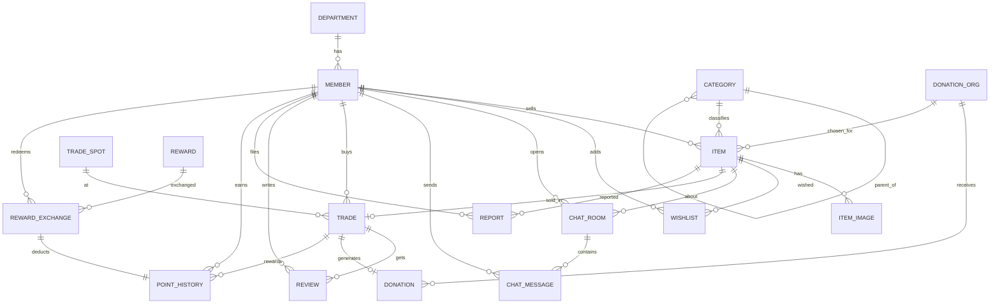

# 1차 기획안: 다시, 캠퍼스 (ReCampus)

> 캠퍼스 안에서 물건이 버려지지 않고 다시 쓰이도록, 학생끼리 사고팔고 나누며 그 일부가 기부로 이어지는 **캠퍼스 순환·나눔 마켓**

---

## 1. 프로젝트명

**다시, 캠퍼스 (ReCampus)**: 기부 연계형 캠퍼스 중고·나눔 거래 플랫폼

---

## 2. 프로젝트 주제 및 비즈니스 모델

### 주제
같은 학교 학생들이 전공 서적, 소형 가전, 가구, 자취 용품 등을 **판매하거나 무료로 나눔**하고, 판매 시 **판매 금액의 일부를 선택한 기부처에 기부**할 수 있는 웹 서비스입니다.

### 비즈니스 모델

| 구분 | 내용 |
|---|---|
| 핵심 가치 | 학교 인증 회원끼리의 안전한 교내 거래 + 버려질 물건의 재사용 + 자연스러운 기부 참여 |
| 거래 방식 | ① 일반 판매 ② 무료 나눔 ③ 기부 연계 판매(판매금의 일부 %를 기부) |
| 나눔 포인트 | 기부 연계 판매·무료 나눔을 한 회원에게 **나눔 포인트** 적립 → 학생회 제휴 매장(카페, 복사실 등) 쿠폰이나 학생회 굿즈로 교환 |
| 수익/지속 방안 | 학생회·학교 ESG 담당 부서와 제휴하여 **자원 재사용량·기부액 통계 리포트** 제공 (개인 거래 수수료는 받지 않음). 교환 쿠폰은 제휴 매장이 홍보 목적으로 제공 |
| 사회적 가치 | 폐기물 감소, 학생들의 소액 기부 참여 확대, 기부 내역 공개로 투명성 확보 |

---

## 3. 해결하고자 하는 문제

1. **학기 말 대량 폐기**: 졸업, 휴학, 기숙사 퇴사, 자취방 이사 시기마다 멀쩡한 책·가전·가구가 버려집니다. 급하게 처분해야 해서 팔 곳을 찾을 시간이 부족합니다.
2. **기존 중고 앱의 한계**: 일반 중고거래 앱은 지역 단위라 같은 학교 학생을 찾기 어렵고, 전공 서적처럼 학교 안에서만 수요가 있는 물건은 거래가 잘 이뤄지지 않습니다. 거래 상대의 신원도 불확실합니다.
3. **나눔의 비효율**: 에브리타임·단톡방에 올라오는 나눔 글은 흩어져 있어 찾기 어렵고, 누가 받아 갔는지 기록이 남지 않습니다.
4. **기부 참여의 진입 장벽**: 학생들은 기부 의향은 있지만 별도로 기부하기는 번거롭고, 기부금이 어디로 갔는지 알기 어렵습니다.
5. **나눔·기부의 동기 부족**: 판매금 일부를 기부하거나 무료로 나누면 판매자는 그만큼 손해를 보기 때문에, 보상이 없으면 참여가 일회성에 그칩니다.

→ **학교 인증 기반 거래 + 나눔 + 기부를 하나의 데이터 흐름으로 연결**해 위 문제를 해결합니다.

---

## 4. 주요 사용자

| 사용자 | 설명 | 주요 행동 |
|---|---|---|
| 일반 학생 (판매자/나눔자) | 졸업·이사 등으로 물건을 처분하려는 학생 | 상품 등록, 기부 비율 설정, 채팅, 거래 완료 처리 |
| 일반 학생 (구매자/수령자) | 저렴한 전공서·자취 용품이 필요한 학생, 신입생 | 검색·필터, 찜, 채팅, 후기 작성 |
| 관리자 | 서비스 운영자 | 신고 처리, 기부처 등록·관리, 전체 통계 확인 |
| 기부처 (제휴 단체) | 기부금을 받는 단체 | (조회 위주) 기부 내역 확인 |

---

## 5. 핵심 기능

### 5-1. 회원
- 학교 이메일 인증 회원가입 / 로그인
- 학과 정보, 거래 신뢰도(후기 평점 기반) 표시

### 5-2. 상품 (CRUD)
- 상품 등록·수정·삭제·조회 (사진 여러 장)
- 거래 유형 선택: 판매 / 무료 나눔 / 기부 연계 판매(기부처 + 기부 비율)
- 상품 상태: 판매중 → 예약중 → 거래완료

### 5-3. 검색 / 필터 / 정렬
- 키워드 검색 (상품명, 설명)
- 필터: 카테고리, 가격대, 거래 유형(나눔만 보기, 기부 상품만 보기), 거래 장소, 상태
- 정렬: 최신순, 가격순, 찜 많은 순

### 5-4. 찜 · 채팅 · 거래
- 관심 상품 찜하기
- 상품별 1:1 채팅방, 메시지
- 거래 확정(구매자, 최종 가격, 교내 거래 장소 기록)
- 거래 완료 시 기부 연계 상품이면 **기부 내역 자동 생성**

### 5-5. 나눔 포인트
- **적립**: 거래가 완료되고 구매자 후기가 등록되면 지급 (허위 거래로 포인트를 쌓는 것을 막기 위해)
  - 기부 연계 판매: 기부액의 10%를 포인트로 적립 (예: 2,000원 기부 → 200P)
  - 무료 나눔: 건당 100P
- **사용**: 제휴 매장 쿠폰·학생회 굿즈로 교환, 교환 시 포인트 차감
- **내역**: 적립·사용 내역을 원장(ledger) 방식으로 모두 기록하고, 잔액은 내역의 합계로 계산

### 5-6. 후기 · 신고
- 거래 완료 후 상호 후기(별점, 코멘트) → 회원 신뢰도에 반영
- 부적절한 상품/회원 신고 및 관리자 처리

### 5-7. 통계 대시보드
- 기부처별 누적 기부액, 월별 기부 추이
- 카테고리별 거래 건수와 평균 거래가
- 학과별 거래·나눔 참여 순위
- 신뢰도 상위 회원, 찜은 많지만 아직 거래되지 않은 상품
- 포인트 적립 상위 회원(나눔 랭킹), 리워드별 교환 횟수

---

## 6. 예상 테이블 구성 및 데이터 구조

> 1차 기획 단계의 예상 구조이며, 이후 정규화와 구현 과정에서 수정·보완합니다.

### 6-1. 테이블 목록 (17개)

| # | 테이블 | 설명 | 주요 컬럼 | 필요한 이유 |
|---|---|---|---|---|
| 1 | `department` 학과 | 학과 정보 | **dept_id** PK, dept_name, college | 학과별 통계, 전공서 추천 기준 |
| 2 | `member` 회원 | 학교 인증 회원 | **member_id** PK, dept_id FK, email(UNIQUE), nickname, student_no, role, trust_score, created_at | 모든 거래·후기·기부의 주체 |
| 3 | `category` 카테고리 | 상품 분류(계층형) | **category_id** PK, parent_id FK(자기참조), name | 대분류·소분류(예: 도서 > 전공서) 필터 |
| 4 | `trade_spot` 거래장소 | 교내 지정 거래 장소 | **spot_id** PK, name, building, description | 안전한 교내 거래, 장소별 거래 통계 |
| 5 | `donation_org` 기부처 | 제휴 기부 단체 | **org_id** PK, name, field, description, is_active | 기부 연계 판매 시 기부 대상 |
| 6 | `item` 상품 | 판매/나눔 물품 | **item_id** PK, seller_id FK, category_id FK, org_id FK(NULL 허용), title, description, price, trade_type(SALE/FREE/DONATION), donation_rate, condition, status, view_count, created_at | 서비스의 중심 엔터티 |
| 7 | `item_image` 상품이미지 | 상품 사진 | **image_id** PK, item_id FK, url, sort_order | 상품 1개에 사진 여러 장(1:N) |
| 8 | `wishlist` 찜 | 회원-상품 관심 | **(member_id, item_id)** 복합 PK, created_at | 회원과 상품의 M:N 관계 해소 |
| 9 | `chat_room` 채팅방 | 상품별 구매 문의방 | **room_id** PK, item_id FK, buyer_id FK, created_at, UNIQUE(item_id, buyer_id) | 한 상품에 여러 구매 희망자 |
| 10 | `chat_message` 메시지 | 채팅 메시지 | **message_id** PK, room_id FK, sender_id FK, content, sent_at, is_read | 채팅방 1:N 메시지 |
| 11 | `trade` 거래 | 확정된 거래 | **trade_id** PK, item_id FK(UNIQUE), buyer_id FK, spot_id FK, final_price, status, traded_at | 실제 성사된 거래 기록(상품 1:1) |
| 12 | `review` 거래후기 | 거래 상호 평가 | **review_id** PK, trade_id FK, reviewer_id FK, reviewee_id FK, rating, comment, UNIQUE(trade_id, reviewer_id) | 신뢰도 산정 |
| 13 | `donation` 기부내역 | 거래로 발생한 기부 | **donation_id** PK, trade_id FK(UNIQUE), org_id FK, member_id FK, amount, donated_at | 기부액 집계·투명한 내역 공개 |
| 14 | `report` 신고 | 상품/회원 신고 | **report_id** PK, reporter_id FK, target_item_id FK(NULL 허용), target_member_id FK(NULL 허용), reason, status, handled_at | 안전한 거래 환경, 관리자 업무 |
| 15 | `point_history` 포인트내역 | 포인트 적립·사용 원장 | **point_id** PK, member_id FK, amount(+적립/−사용), reason(DONATION/FREE_SHARE/EXCHANGE), trade_id FK(NULL 허용), exchange_id FK(NULL 허용), created_at | 잔액만 저장하면 언제 왜 늘고 줄었는지 알 수 없으므로 모든 변동을 기록 |
| 16 | `reward` 리워드 | 포인트로 교환 가능한 상품 | **reward_id** PK, name, partner_name, required_point, stock, is_active | 제휴 쿠폰·굿즈 목록과 재고 관리 |
| 17 | `reward_exchange` 리워드교환 | 회원의 리워드 교환 기록 | **exchange_id** PK, member_id FK, reward_id FK, used_point, status, exchanged_at | 회원-리워드 M:N 관계 해소, 교환 이력 |

### 6-2. 주요 관계 및 설계 이유

| 관계 | 카디널리티 | 설계 이유 |
|---|---|---|
| department – member | 1 : N | 한 학과에 여러 학생 |
| member – item | 1 : N | 한 회원이 여러 상품 등록 (seller_id) |
| category – category | 1 : N (자기참조) | 대분류/소분류 계층 표현 |
| category – item | 1 : N | 상품은 하나의 (소)카테고리에 속함 |
| item – item_image | 1 : N | 사진 개수가 상품마다 달라 별도 테이블로 분리(1정규형) |
| member – item (찜) | M : N → `wishlist` | 한 회원이 여러 상품을, 한 상품을 여러 회원이 찜 |
| item – chat_room – member | 1 : N / N : 1 | 같은 상품에 여러 구매 희망자가 각각 채팅 |
| chat_room – chat_message | 1 : N | 대화 내역 저장 |
| item – trade | 1 : 0..1 | 상품은 최대 한 번 거래됨 (trade.item_id UNIQUE) |
| trade – review | 1 : 0..2 | 판매자와 구매자가 서로 1개씩 후기 |
| trade – donation | 1 : 0..1 | 기부 연계 상품의 거래일 때만 기부 발생 |
| donation_org – item / donation | 1 : N | 상품 등록 시 기부처 선택, 거래 시 실제 기부 기록 |
| trade_spot – trade | 1 : N | 거래 장소 정규화, 장소별 통계 |
| member – point_history | 1 : N | 회원별 포인트 변동 이력, 잔액 = SUM(amount) |
| trade – point_history | 1 : 0..1 | 어떤 거래로 적립됐는지 추적 |
| member – reward (교환) | M : N → `reward_exchange` | 한 회원이 여러 리워드를, 한 리워드를 여러 회원이 교환 |
| reward_exchange – point_history | 1 : 1 | 교환 1건당 포인트 차감 기록 1건 |

**설계 포인트**
- `item.price`(희망가)와 `trade.final_price`(실제 거래가)를 분리해 흥정 결과와 실제 거래가 통계를 정확히 냅니다.
- `donation.amount`는 거래 시점의 `final_price × donation_rate`로 계산해 저장합니다. 이후 상품의 기부 비율이 바뀌어도 이미 발생한 기부 기록은 변하지 않게 하기 위함입니다.
- 포인트 잔액은 `member`에 컬럼으로 두지 않고 `point_history`의 합계로 계산합니다. 교환 시에는 잔액 확인 → `reward_exchange` 생성 → `point_history` 차감 → `reward.stock` 감소를 **하나의 트랜잭션**으로 처리해 포인트가 음수가 되거나 재고보다 많이 교환되는 일을 막습니다.
- 회원 `trust_score`는 `review`에서 계산 가능한 파생값이지만, 목록 화면 조회 성능을 위해 저장하고 후기 등록 시 갱신하는 방식을 검토합니다(반정규화 여부는 2차 설계에서 결정).

### 6-3. 예상 ERD



### 6-4. 활용할 SQL 예시

**① 기부처별 누적 기부액과 기부 건수 (JOIN + 집계)**
```sql
SELECT o.name AS 기부처, COUNT(d.donation_id) AS 기부건수, COALESCE(SUM(d.amount), 0) AS 누적기부액
FROM donation_org o
LEFT JOIN donation d ON d.org_id = o.org_id
GROUP BY o.org_id, o.name
ORDER BY 누적기부액 DESC;
```

**② 카테고리별 평균 거래가와 희망가 대비 할인율 (다중 JOIN + 집계)**
```sql
SELECT c.name AS 카테고리, COUNT(*) AS 거래수,
       ROUND(AVG(t.final_price)) AS 평균거래가,
       ROUND(AVG(1 - t.final_price::numeric / NULLIF(i.price, 0)) * 100, 1) AS 평균할인율
FROM trade t
JOIN item i ON i.item_id = t.item_id
JOIN category c ON c.category_id = i.category_id
WHERE i.trade_type <> 'FREE'
GROUP BY c.category_id, c.name;
```

**③ 찜이 5개 이상인데 아직 거래되지 않은 상품 (서브쿼리 + HAVING)**
```sql
SELECT i.item_id, i.title, COUNT(w.member_id) AS 찜수
FROM item i
JOIN wishlist w ON w.item_id = i.item_id
WHERE NOT EXISTS (SELECT 1 FROM trade t WHERE t.item_id = i.item_id)
GROUP BY i.item_id, i.title
HAVING COUNT(w.member_id) >= 5
ORDER BY 찜수 DESC;
```

**④ 학과별 나눔 참여 순위 (JOIN + 집계 + 정렬)**
```sql
SELECT dp.dept_name, COUNT(i.item_id) AS 나눔물품수
FROM item i
JOIN member m ON m.member_id = i.seller_id
JOIN department dp ON dp.dept_id = m.dept_id
WHERE i.trade_type = 'FREE'
GROUP BY dp.dept_id, dp.dept_name
ORDER BY 나눔물품수 DESC;
```

**⑤ 평균 평점이 전체 평균보다 높은 판매자 (스칼라 서브쿼리)**
```sql
SELECT m.nickname, ROUND(AVG(r.rating), 2) AS 평균평점, COUNT(*) AS 후기수
FROM review r
JOIN member m ON m.member_id = r.reviewee_id
GROUP BY m.member_id, m.nickname
HAVING AVG(r.rating) > (SELECT AVG(rating) FROM review);
```

**⑥ 회원별 포인트 잔액과 이번 학기 나눔 랭킹 (집계 + 조건부 합계)**
```sql
SELECT m.nickname,
       SUM(p.amount) AS 현재잔액,
       SUM(CASE WHEN p.amount > 0 AND p.created_at >= '2026-09-01' THEN p.amount ELSE 0 END) AS 이번학기적립
FROM member m
JOIN point_history p ON p.member_id = m.member_id
GROUP BY m.member_id, m.nickname
ORDER BY 이번학기적립 DESC
LIMIT 10;
```

---

## 7. 향후 구현 계획

### 기술 스택 (예정, 변경 가능)
- **DB**: PostgreSQL (수업 실습 환경과 동일)
- **Backend**: Node.js (Express)
- **Frontend**: React
- **도구**: 생성형 AI(Claude 등)를 활용한 바이브코딩, GitHub로 버전 관리, ERD 도구(dbdiagram.io / ERDCloud)

### 단계별 일정

| 단계 | 기간(예정) | 내용 | 산출물 |
|---|---|---|---|
| 1단계 | 1차 기획 | 주제·문제·사용자 정의, 예상 테이블 도출 | `01_proposal/proposal.md` |
| 2단계 | DB 분석·설계 | 요구사항 정리, ERD 확정, 정규화(1NF~3NF) 검토, 제약조건(PK/FK/UNIQUE/CHECK) 정의 | ERD 이미지, `schema.sql` |
| 3단계 | 샘플 데이터 | 학과·카테고리·회원·상품·거래 등 현실적인 샘플 데이터 구성 (AI 활용 생성 후 검수) | `sample_data.sql` |
| 4단계 | SQL 기능 구현 | CRUD, 검색/필터/정렬, JOIN·집계·서브쿼리 통계 쿼리 작성 및 검증, 필요 시 VIEW·인덱스·트랜잭션 적용(거래 완료 시 trade·donation·item 상태·포인트 적립을, 리워드 교환 시 차감·재고 감소를 각각 하나의 트랜잭션으로 처리) | `queries.sql` |
| 5단계 | 애플리케이션 구현 | 웹 화면(상품 목록·상세·등록, 채팅, 거래, 마이페이지, 통계 대시보드)과 DB 연동 | 소스 코드 |
| 6단계 | 테스트·발표 | 시나리오 테스트, 개선 사항 반영, 최종 발표 자료 정리 | 최종 보고서, 시연 |

### 레포지토리 구조 (예정)
```
database-project/
├── 01_proposal/
│   └── proposal.md
├── 02_design/        # ERD, 정규화 문서, schema.sql
├── 03_data/          # sample_data.sql
├── 04_sql/           # 기능·통계 쿼리
└── 05_app/           # 웹 애플리케이션 소스
```

### 향후 확장 아이디어
- 졸업 예정자의 물건을 신입생에게 우선 연결하는 매칭 기능
- 재사용된 물품 수 기반의 "자원 절감 리포트"(예: 이번 학기에 버려지지 않은 물품 수)
- 기부처별 기부금 사용 내역 공개 페이지
